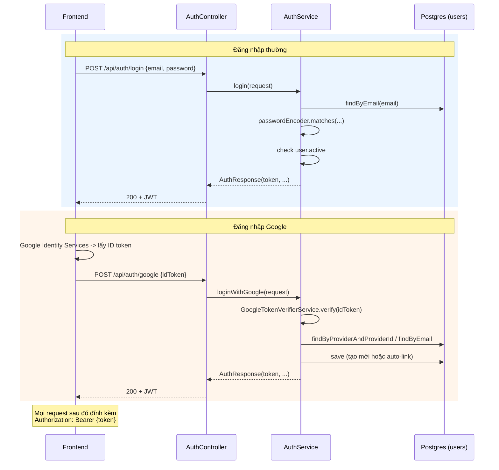

# Cinema Booking System — Tài liệu giải thích source code

> Tài liệu này dành cho **dev mới** tải repo về và cần hiểu source code
> làm gì, ở đâu, tại sao — trước khi sửa hay thêm tính năng. Khác với
> [`ROADMAP.md`](./ROADMAP.md) (bức tranh lớn: đang ở giai đoạn nào,
> sắp làm gì) và [`PROGRESS_LOG.md`](./PROGRESS_LOG.md) (nhật ký từng
> task theo thời gian), file này giải thích **code hiện tại hoạt động
> như thế nào**, đọc không cần biết lịch sử đã sửa gì.
>
> Cách đọc gợi ý: đọc Phần 1 (kiến trúc chung) trước tiên — nó là chìa
> khoá để hiểu mọi module khác, vì toàn bộ 14 module trong dự án đều lặp
> lại đúng 1 pattern đó. Sau đó đọc theo thứ tự nghiệp vụ thật của
> user: Auth → Catalog (phim/rạp/ghế) → Showtime → Booking → Payment.

## Mục lục

1. [Kiến trúc tổng quan](#1-kiến-trúc-tổng-quan)
2. [Xác thực & phân quyền (Auth/Security)](#2-xác-thực--phân-quyền-authsecurity)
3. [Admin quản lý User](#3-admin-quản-lý-user)
4. [Catalog: Phim, Rạp, Phòng, Ghế](#4-catalog-phim-rạp-phòng-ghế)
5. [Suất chiếu (Showtime)](#5-suất-chiếu-showtime)
6. [Đặt vé (Booking)](#6-đặt-vé-booking)
7. [Thanh toán & vé điện tử (Payment)](#7-thanh-toán--vé-điện-tử-payment)
8. [Admin quản lý Booking](#8-admin-quản-lý-booking)
9. [Luồng đầy đủ: từ mở app đến cầm vé trên tay](#9-luồng-đầy-đủ-từ-mở-app-đến-cầm-vé-trên-tay)
10. [Bảng tổng hợp toàn bộ endpoint](#10-bảng-tổng-hợp-toàn-bộ-endpoint)

---

## 1. Kiến trúc tổng quan

### 1.1. Stack công nghệ

| Thành phần | Dùng để làm gì |
|---|---|
| Java 21 + Spring Boot 3 | Nền tảng chính |
| PostgreSQL + Flyway | DB quan hệ; Flyway là **nguồn sự thật duy nhất** cho schema — Hibernate chỉ *validate* entity có khớp bảng thật không (`ddl-auto: validate`), không tự sinh bảng. Nếu code và DB lệch nhau, app **báo lỗi ngay lúc khởi động** thay vì âm thầm sai. |
| Spring Security + JWT (`io.jsonwebtoken`/jjwt) | Xác thực API — tự viết bằng thư viện jjwt, **không** dùng Spring Security OAuth2 auto-config (xem Phần 2). |
| `google-api-client` | Verify chữ ký ID token của Google (Login Google/SSO) |
| Redis (đã có trong `docker-compose.yml`) | Chưa dùng ở Giai đoạn 1 — để dành cho seat-hold (giữ ghế tạm) ở Giai đoạn 2 |
| ZXing | Sinh QR code (PNG) cho vé sau khi thanh toán |
| springdoc-openapi | Swagger UI tự sinh tại `/swagger-ui.html` — cách nhanh nhất để "bấm thử" API mà không cần Postman |

### 1.2. Kiến trúc phân lớp — **1 pattern lặp lại cho mọi module**

Toàn bộ 14 domain package (`movie`, `genre`, `actor`, `brand`, `cinema`,
`room`, `seattype`, `seat`, `showtime`, `booking`, `payment`, `auth`,
`user`, `security`) đều tổ chức **theo tính năng** (package-by-feature),
không phải theo layer (không có package `controllers/`, `services/`
dùng chung cho cả app). Bên trong mỗi package, luồng xử lý 1 request
luôn đi qua đúng 4 lớp theo thứ tự:

```
HTTP request
    │
    ▼
Controller  (@RestController)     — nhận request, validate DTO (@Valid), gọi Service, KHÔNG chứa logic nghiệp vụ
    │
    ▼
Service     (@Service)            — TOÀN BỘ logic nghiệp vụ, validation, throw exception khi sai quy tắc
    │
    ▼
Repository  (interface JpaRepository) — chỉ khai báo, Spring Data JPA tự sinh implementation
    │
    ▼
Entity      (@Entity)             — map 1-1 với 1 bảng Postgres (Flyway tạo bảng, Entity chỉ mô tả lại)
    │
    ▼
PostgreSQL
```

Chiều ngược lại (trả response), Service **không trả Entity thẳng ra
Controller** — luôn đi qua 1 lớp `XxxMapper` (class tĩnh, tự viết tay,
**cố tình không dùng MapStruct**) để chuyển Entity → `XxxResponse`
(record). Lý do tách DTO khỏi Entity: tránh lộ field nội bộ (VD
`passwordHash`), tránh vòng lặp vô hạn khi serialize quan hệ 2 chiều
(VD `Movie` ↔ `MovieCast` ↔ `Actor`), và tách "hình dạng dữ liệu lưu
trong DB" khỏi "hình dạng dữ liệu trả cho client" — 2 thứ đổi độc lập
nhau.

**Ví dụ cụ thể — package `genre` (module đơn giản nhất, đáng đọc đầu
tiên để nắm pattern):**

```
genre/
├── Genre.java              — @Entity, map bảng "genres" (id, name)
├── GenreRepository.java    — interface JpaRepository<Genre, Long>, không có query method riêng
├── GenreMapper.java        — static Genre -> GenreResponse
├── GenreService.java       — findAll/findById/create/update/delete, check trùng "name" khi create/update
├── GenreController.java    — @RequestMapping("/api/admin/genres"), map HTTP verb -> method Service
└── dto/
    ├── GenreRequest.java   — record dùng khi POST/PUT (input)
    └── GenreResponse.java  — record dùng khi trả response (output)
```

Khi đọc bất kỳ module nào khác (Brand, Cinema, Room, SeatType, Actor),
áp đúng bộ khung này — chỉ khác nhau ở **field** và **rule validate**
riêng của từng entity.

### 1.3. Xử lý lỗi tập trung — `GlobalExceptionHandler`

Thay vì mỗi Controller tự viết `try/catch`, dự án dùng
`@RestControllerAdvice` (`common/exception/GlobalExceptionHandler.java`)
— 1 nơi duy nhất bắt exception ném ra từ Service và map sang HTTP status
+ body JSON chuẩn hoá (`ApiError`):

```java
public record ApiError(
        Instant timestamp,
        int status,
        String message,
        Map<String, String> fieldErrors   // chỉ có giá trị khi lỗi validate @Valid (400)
) { ... }
```

Bảng exception tự viết và ý nghĩa (toàn bộ `extends RuntimeException`,
nằm ở `common/exception/`):

| Exception | HTTP | Ném khi nào |
|---|---|---|
| `ResourceNotFoundException` | 404 | Không tìm thấy entity theo id (dùng ở **mọi** module — Movie, Brand, Cinema, Booking...) |
| `EmailAlreadyExistsException` | 409 | Đăng ký với email đã tồn tại |
| `InvalidCredentialsException` | 401 | Sai email/password lúc login; token Google không hợp lệ; tài khoản bị khoá |
| `InvalidResetTokenException` | 400 | Token quên mật khẩu không tồn tại/hết hạn/đã dùng |
| `BookingConflictException` | 409 | Ghế đã bị người khác giữ (booking PENDING/PAID); huỷ 1 booking không còn PENDING |
| `SelfActionNotAllowedException` | 409 | Admin tự khoá/tự đổi role chính mình |
| `MethodArgumentNotValidException` (có sẵn của Spring, không tự viết) | 400 | Bean Validation (`@NotBlank`, `@Email`, `@Size`...) trên DTO thất bại — response có kèm `fieldErrors` chỉ rõ field nào sai |

Nhờ vậy, Service **chỉ cần `throw new XxxException("...")`**, không cần
biết gì về HTTP — tách biệt rõ "lỗi nghiệp vụ là gì" khỏi "lỗi đó thành
mã HTTP nào".

### 1.4. Public API vs Admin API — quy ước đặt tên

Những entity vừa cần CRUD cho Admin vừa cần đọc cho User thường (Movie,
Brand, Cinema, Showtime) có **2 Controller riêng** thay vì 1 Controller
dùng chung:

- `XxxController` → `/api/admin/xxx` — CRUD đầy đủ, yêu cầu `ROLE_ADMIN`.
- `XxxPublicController` → `/api/xxx` — chỉ đọc (`GET`), không cần đăng
  nhập.

Cả 2 dùng chung `XxxService`/`XxxRepository`/`XxxMapper` — không lặp
code nghiệp vụ, chỉ khác controller nào gọi method nào của Service.

---

## 2. Xác thực & phân quyền (Auth/Security)

### 2.1. Vì sao JWT tự viết, không dùng Spring Security OAuth2 auto-config

Backend là REST API thuần **stateless** (không session, không cookie),
frontend là SPA (React) tách riêng hoàn toàn. Với kiến trúc này:

- Login thường: tự sinh/verify JWT bằng thư viện `jjwt` (không dùng
  `spring-boot-starter-oauth2-resource-server` vì chỉ cần 1 secret
  key đối xứng (HS256), không cần cả bộ máy OAuth2 Resource Server).
- Login Google: dùng **ID token flow** (client lấy ID token trực tiếp
  từ Google, gửi lên BE verify) thay vì `spring-boot-starter-oauth2-client`
  (Authorization Code redirect flow) — flow đó sinh ra để phục vụ app
  server-rendered có session, không hợp với SPA + REST API thuần, và
  chỉ thật sự cần thiết khi BE phải gọi tiếp API Google thay mặt user
  (không phải trường hợp ở đây, chỉ cần định danh để login).

### 2.2. Các thành phần trong `security/`

**`JwtService.java`** — sinh và verify JWT của **app** (không phải JWT
của Google):

```java
public String generateToken(User user) {
    // subject = userId, claim "email" + "role" đính kèm trong payload
    // để JwtAuthenticationFilter dựng lại UserPrincipal mà KHÔNG cần
    // query lại DB mỗi request (đúng tinh thần stateless)
}

public Claims parseClaims(String token) {
    // verify chữ ký bằng secret key (jwt.secret trong application.yml)
    // + kiểm tra hạn (expiration) - ném JwtException nếu sai chữ ký/hết hạn/sai định dạng
}
```

**`JwtAuthenticationFilter.java`** — 1 `OncePerRequestFilter` chạy
trước mọi request:

1. Đọc header `Authorization: Bearer <token>`.
2. Nếu có → `jwtService.parseClaims(token)` → dựng `UserPrincipal(id, email, role)` → set vào `SecurityContextHolder`.
3. Nếu token sai/hết hạn (`JwtException`) → **không** tự trả lỗi ở đây, chỉ `clearContext()` rồi cho request đi tiếp — để `SecurityFilterChain` (bước sau) tự quyết định 401 dựa trên rule của từng URL.
4. Nếu **không có** header → cũng cho đi tiếp bình thường — vì có những endpoint public không cần token.

Nói cách khác: **filter này không chặn ai cả**, nó chỉ "dịch" token
(nếu có) thành `Authentication`. Việc "endpoint này có bắt buộc đăng
nhập không" là trách nhiệm của bước tiếp theo.

**`SecurityConfig.java`** — khai báo rule theo tiền tố URL (`securityFilterChain`
bean), thứ tự ưu tiên từ trên xuống:

```java
.requestMatchers("/api/auth/**", "/api/health").permitAll()
.requestMatchers(HttpMethod.GET, "/api/movies/**", "/api/brands/**", "/api/cinemas/**", "/api/showtimes/**").permitAll()
.requestMatchers("/swagger-ui/**", "/swagger-ui.html", "/v3/api-docs/**").permitAll()
.requestMatchers("/api/admin/**").hasRole("ADMIN")
.anyRequest().authenticated()   // còn lại (booking, payment...) bắt buộc đăng nhập, không cần role cụ thể
```

Session bị tắt hẳn (`SessionCreationPolicy.STATELESS`), CSRF/form
login/http basic đều `disable` (không cần — không dùng cookie/session).
Khi 1 request bị từ chối, `exceptionHandling` tự viết JSON lỗi
(`ApiError`) thay vì trang lỗi HTML mặc định của Spring Security — để
FE luôn nhận được JSON nhất quán dù lỗi 401 hay 403.

**`UserPrincipal.java`** — record nhẹ `(Long id, String email, UserRole role)`,
chính là object bạn lấy được khi viết `@AuthenticationPrincipal UserPrincipal principal`
trong bất kỳ Controller nào cần biết "ai đang gọi API này" (VD
`BookingController`, `UserController`).

### 2.3. Luồng Đăng ký (`POST /api/auth/register`)

`AuthController.register()` → `AuthService.register()`:

1. Check `userRepository.existsByEmail(email)` — nếu đã tồn tại, `throw EmailAlreadyExistsException` → 409.
2. Tạo `User` mới: `passwordHash = passwordEncoder.encode(password)` (BCrypt, bean khai báo ở `SecurityConfig`), `provider = "LOCAL"`, `role = USER`.
3. Lưu DB, sinh JWT (`jwtService.generateToken`), trả `AuthResponse(token, userId, name, email, role)`.

### 2.4. Luồng Đăng nhập thường (`POST /api/auth/login`)

`AuthService.login()`:

1. Tìm user theo email — không thấy → `InvalidCredentialsException` ("Email hoặc mật khẩu không đúng" — **cố tình dùng message chung chung**, không nói rõ "sai email" hay "sai password" để tránh lộ thông tin email nào đã đăng ký).
2. So khớp password: `passwordEncoder.matches(rawPassword, user.passwordHash)` — sai cũng ném đúng exception ở bước 1 (cùng message).
3. Check `user.active` — tài khoản bị khoá (admin khoá, xem Phần 3) → `InvalidCredentialsException("Tài khoản đã bị khoá")`.
4. Qua hết 3 bước → sinh JWT, trả `AuthResponse`.

### 2.5. Luồng Quên mật khẩu (`POST /api/auth/forgot-password` + `POST /api/auth/reset-password`)

Cơ chế: sinh 1 **reset token** ngẫu nhiên, lưu tạm trong bảng
`password_reset_tokens` (Postgres) với hạn dùng (TTL) 30 phút, gửi cho
user qua email chứa link `?token=...`. Vì dự án **chưa tích hợp SMTP
thật**, bước "gửi email" hiện tại chỉ là `log.info(...)` ra console
server — khi có SMTP thật, chỉ cần thay phần gửi này, không đổi API
contract.

**`forgotPassword(email)`:**
```java
userRepository.findByEmail(email).ifPresent(user -> {
    // sinh token bằng PasswordResetTokenGenerator (SecureRandom 32 byte + Base64 URL-safe
    // - CAO entropy hơn hẳn TicketCodeGenerator vì token này phải KHÔNG đoán được)
    // lưu PasswordResetToken: expiresAt = now + 30 phút
    // log token ra console thay vì gửi email thật
});
// KHÔNG throw gì nếu email không tồn tại — trả 200 im lặng trong mọi trường hợp
```
Điểm quan trọng nhất của method này: **không bao giờ throw dù email
không tồn tại**. Nếu throw (VD `ResourceNotFoundException`), kẻ tấn
công có thể thử hàng loạt email và suy ra email nào đã đăng ký chỉ
bằng cách xem response khác nhau (404 vs 200) — gọi là *user
enumeration attack*. Trả 200 đồng nhất trong mọi trường hợp là cách
chuẩn để chặn kiểu dò này.

**`resetPassword(token, newPassword)`:**
```java
PasswordResetToken resetToken = passwordResetTokenRepository.findByToken(token)
        .orElseThrow(() -> new InvalidResetTokenException("Token khong hop le"));
if (resetToken.usedAt != null || resetToken.expiresAt.isBefore(now)) {
    throw new InvalidResetTokenException("Token da het han hoac da duoc su dung");
}
user.passwordHash = passwordEncoder.encode(newPassword);
resetToken.usedAt = now;   // đánh dấu đã dùng - token chỉ xài được đúng 1 lần
```

### 2.6. Luồng Đăng nhập Google/SSO (`POST /api/auth/google`)

**Bối cảnh kiến trúc:** frontend dùng thư viện "Google Identity
Services" để hiện nút "Sign in with Google", người dùng đăng nhập Google
ngay trên trình duyệt (không qua BE), Google trả về 1 **ID token** (JWT
do chính Google ký) cho frontend. Frontend gửi nguyên token đó lên BE —
BE **không tự tay gọi Google**, chỉ verify chữ ký token là đủ để biết
"đúng là Google xác nhận danh tính này".

**`GoogleTokenVerifierService.verify(idToken)`** (bọc SDK
`google-api-client`):
```java
GoogleIdToken idToken = verifier.verify(idTokenString);
// verifier tự động: tải public key hiện hành của Google (JWKS), tự cache + tự xoay vòng
// khi Google đổi key theo chu kỳ, kiểm tra chữ ký + audience (phải khớp google.client-id
// đã cấu hình) + hạn dùng token. Verify thất bại (kể cả exception bất kỳ) -> ném
// InvalidCredentialsException("Google token khong hop le") - tái dùng exception có sẵn
// vì bản chất cũng là "không xác thực được", như sai email/password.
return new GoogleUserInfo(payload.getSubject(), payload.getEmail(), payload.get("name"), payload.getEmailVerified());
```
`payload.getSubject()` (gọi tắt là `sub`) là **ID vĩnh viễn** của 1 tài
khoản Google — không đổi kể cả khi user đổi email Google, nên đây mới
là khoá định danh đáng tin, không phải email.

**`AuthService.loginWithGoogle(idToken)`:**

1. Verify token (ở trên) → nếu `emailVerified = false` → `InvalidCredentialsException` (Google có tài khoản chưa xác minh email, ví dụ 1 số tài khoản G Suite nội bộ — không tin tưởng được).
2. Tìm user theo `(provider="GOOGLE", providerId=sub)` trước — đây là lần đăng nhập Google **thứ 2 trở đi**, đã có sẵn từ lần đầu.
3. Nếu không thấy, fallback tìm theo **email** — 2 khả năng:
   - Lần đầu đăng nhập Google, chưa từng có tài khoản nào.
   - Email này **đã từng đăng ký thường** (LOCAL, có password) — trường hợp "auto-link": vì Google đã xác minh user sở hữu email này thật (`emailVerified=true`), gán luôn `provider=GOOGLE`+`providerId` cho tài khoản LOCAL đó **mà không xoá `passwordHash`** — user vẫn đăng nhập thường bằng password cũ được bình thường sau này, chỉ là giờ đăng nhập Google cũng vào đúng tài khoản đó thay vì tạo bản sao.
4. Không thấy ở cả 2 bước trên → tạo `User` mới (`name` lấy từ Google, `role=USER`, không có `passwordHash`).
5. Check `user.active` giống hệt `login()` — tài khoản bị khoá vẫn bị chặn dù đăng nhập qua Google.
6. Set `provider="GOOGLE"` + `providerId=sub` (luôn set lại, kể cả user cũ) → lưu → sinh JWT → trả `AuthResponse` — **cùng hình dạng response** như `login()`/`register()`, nên phía FE xử lý sau khi có token giống hệt nhau dù đăng nhập bằng cách nào.

**Giới hạn hiện tại:** cần tạo OAuth Client ID thật trên Google Cloud
Console (việc làm thủ công ngoài code) và set env `GOOGLE_CLIENT_ID`
thì mới verify được token thật — hiện `google.client-id` chỉ có
placeholder rỗng.

### 2.7. Sơ đồ luồng Login (thường & Google) — tổng hợp



---

## 3. Admin quản lý User

`UserController` (`/api/admin/users`, yêu cầu `ROLE_ADMIN` qua rule
`/api/admin/**` ở `SecurityConfig`) → `UserService`:

| Method | Endpoint | Làm gì | Check gì |
|---|---|---|---|
| `findAll()` | `GET /api/admin/users` | List toàn bộ user (không filter, không phân trang — quy mô học tập) | — |
| `findById(id)` | `GET /api/admin/users/{id}` | Xem chi tiết 1 user | `ResourceNotFoundException` nếu không tồn tại |
| `updateRole(id, currentAdminId, newRole)` | `PATCH /api/admin/users/{id}/role` | Đổi role USER↔ADMIN | `requireNotSelf` — admin không tự đổi role chính mình (chặn tự hạ quyền/tự nâng quyền qua lỗi thao tác) |
| `lock(id, currentAdminId)` | `PATCH /api/admin/users/{id}/lock` | Set `active=false` | `requireNotSelf` — admin không tự khoá chính mình (tránh tự khoá xong không đăng nhập lại được) |
| `unlock(id)` | `PATCH /api/admin/users/{id}/unlock` | Set `active=true` | Không cần `requireNotSelf` vì mở khoá không nguy hiểm |

`requireNotSelf(targetId, currentAdminId, message)` — so sánh 2 id,
nếu trùng thì `throw SelfActionNotAllowedException(message)` → 409.
`currentAdminId` lấy từ `@AuthenticationPrincipal UserPrincipal
principal` ở Controller — **chính admin đang gọi API**, không phải
param truyền tay được từ client (không thể giả mạo).

**Lưu ý về khoá tài khoản và JWT đã phát hành trước đó (known
limitation, cố tình không fix):** JWT là stateless — `JwtAuthenticationFilter`
không query lại DB mỗi request để kiểm tra `active`. Vì vậy 1 token đã
phát hành trước khi bị khoá **vẫn còn hiệu lực tới khi hết hạn tự
nhiên** (mặc định 24h, `jwt.expiration-ms`). "Khoá tài khoản" đảm bảo:
không đăng nhập được nữa để lấy token mới. **Không** đảm bảo: thu hồi
ngay lập tức token đang cầm trong tay. Muốn thu hồi ngay cần thêm 1
bước tra cứu (VD danh sách token bị revoke trong Redis) — phá vỡ tính
stateless, để dành nếu có nhu cầu thật.

---

## 4. Catalog: Phim, Rạp, Phòng, Ghế

Nhóm module này đều theo đúng pattern CRUD ở Phần 1.2. Điểm chung cần
biết trước khi đọc từng module:

- **Không check trùng tên ở tầng Service.** Những field có `unique =
  true` trong DB (VD `genres.name`, `seat_types.name`) chỉ được đảm bảo
  duy nhất bởi **constraint của Postgres** — nếu tạo trùng, lỗi trả về
  là `DataIntegrityViolationException` (500, thông báo kỹ thuật khó
  hiểu), **không** phải lỗi 409 thân thiện như `EmailAlreadyExistsException`
  bên Auth. Đây là điểm khác biệt có chủ đích: catalog là dữ liệu admin
  tự nhập, ít quan trọng bằng đăng ký tài khoản.
- **Xoá không chặn khi còn dữ liệu con.** VD xoá 1 `Brand` đang có
  `Cinema` thuộc về nó — Service không tự kiểm tra, hành vi thật sự
  phụ thuộc constraint khoá ngoại dưới DB (không thấy `ON DELETE
  CASCADE` cho các quan hệ catalog trong migration, nên nhiều khả năng
  sẽ lỗi FK violation thay vì xoá êm).

### 4.1. Phân cấp Brand → Cinema → Room → Seat

```
Brand (hãng, VD: CGV)
  └─ Cinema (rạp/chi nhánh, brand_id FK)
       └─ Room (phòng chiếu, cinema_id FK)
            └─ Seat (ghế, room_id FK, seat_type_id FK)
```

| Module | Entity — field đáng chú ý | Repository — method riêng | Endpoint Admin | Endpoint Public |
|---|---|---|---|---|
| **Genre** | `name` (unique) | — | `/api/admin/genres` (CRUD) | — |
| **Actor** | `name`, `avatarUrl` | — | `/api/admin/actors` (CRUD) | — |
| **Brand** | `name`, `logoUrl` | — | `/api/admin/brands` (CRUD) | `GET /api/brands` — list toàn bộ |
| **Cinema** | `brand` (`@ManyToOne`), `address`, `city` | `findByBrandId(brandId)` | `/api/admin/cinemas` (CRUD) | `GET /api/brands/{brandId}/cinemas` |
| **Room** | `cinema` (`@ManyToOne`), `roomType` (chuỗi tự do "2D"/"3D", **không phải enum** — DB không có CHECK constraint ràng buộc) | — | `/api/admin/rooms` (CRUD) | — (chỉ lộ gián tiếp qua `roomName` trong response Showtime) |
| **SeatType** | `name` (unique), `priceMultiplier` (`BigDecimal`, mặc định `1.00`) | — | `/api/admin/seat-types` (CRUD) | — |

Với `Cinema`/`Room`, method `update()` cho phép **đổi cha** (đổi
`brandId`/`cinemaId` sang giá trị khác khi PUT) — không phải chỉ tạo
mới mới được gán cha, sửa cũng đổi được, miễn cha mới tồn tại (404 nếu
không).

### 4.2. Sinh ghế theo sơ đồ phòng — `seat/SeatService.generateLayout()`

Đây là API **khác hẳn** CRUD từng dòng thông thường — không có "tạo 1
ghế", "sửa 1 ghế", chỉ có "sinh lại **toàn bộ** sơ đồ ghế của 1 phòng
trong 1 lần gọi": `POST /api/admin/rooms/{roomId}/seats`.

**Request** (`SeatLayoutRequest`) mô tả sơ đồ theo **từng hàng**, không
phải từng ghế:
```json
{
  "rows": [
    { "rowLabel": "A", "columnCount": 10, "seatTypeId": 1 },
    { "rowLabel": "B", "columnCount": 10, "seatTypeId": 1 },
    { "rowLabel": "C", "columnCount": 8,  "seatTypeId": 2 }
  ]
}
```
Nghĩa là: **1 loại ghế áp dụng cho cả 1 hàng** (VD hàng C là VIP hết),
không config được từng ghế lẻ trong 1 hàng khác loại nhau.

**Thuật toán `generateLayout(roomId, request)`:**

1. Load `Room` theo id, không thấy → 404.
2. `resolveSeatTypes()`: gom toàn bộ `seatTypeId` xuất hiện trong mọi
   hàng (loại trùng), **query 1 lần duy nhất** (`findAllById`) thay vì
   query từng hàng — nếu số lượng tìm được ít hơn số id yêu cầu (tức
   có id không tồn tại) → `ResourceNotFoundException` ngay, không sinh
   ghế nào cả.
3. **Chiến lược ghi đè = xoá hết rồi tạo lại (không phải merge/diff):**
   `seatRepository.deleteByRoomId(roomId)` rồi `.flush()` ngay lập tức
   (bắt DELETE chạy xuống DB trước khi INSERT, tránh đụng độ
   `UNIQUE(room_id, row_label, col_number)` giữa ghế cũ và ghế mới nếu
   trùng vị trí).
4. Với mỗi hàng trong `rows`, lặp `col` từ `1` đến `columnCount`, tạo
   1 `Seat` mới `(rowLabel, col, seatType)` — vị trí ghế = `(rowLabel,
   colNumber)`, **không** có khái niệm lối đi/ghế đôi/số ghế dạng chuỗi
   "A1" — response trả `rowLabel` và `colNumber` là 2 field tách rời,
   FE tự ghép chuỗi hiển thị nếu cần.
5. `saveAll()` toàn bộ ghế mới trong 1 lần, trả về.

**Vì sao xoá-tạo-lại được coi là an toàn (comment trong code):** ở
Giai đoạn 1, chưa có `Showtime`/`Booking` nào tham chiếu tới 1
`seat_id` cụ thể tồn tại lâu dài theo kiểu "vé đã bán gắn với ghế
X" — khi có rồi (thực tế giờ **đã có**, xem Phần 6), việc sinh lại sơ
đồ ghế của 1 phòng đang có booking sẽ xoá luôn ghế mà booking cũ đang
tham chiếu → **đây là rủi ro thật cần lưu ý nếu định sửa/dùng API này
sau khi phòng đã có suất chiếu + booking**, code hiện tại chưa có guard
chặn trường hợp đó.

### 4.3. Movie — search, "nổi bật", và quan hệ với Genre/Actor

**Field đáng chú ý trên `Movie`:** `status` (enum `NOW_SHOWING` /
`COMING_SOON` / `ENDED`, khớp CHECK constraint DB), `viewCount`
(`Long`, mặc định `0`).

⚠️ **Phát hiện đáng lưu ý cho dev mới:** `viewCount` được khai báo
nhưng **không có bất kỳ chỗ nào trong code tăng giá trị này** — không
có endpoint "xem chi tiết phim thì +1 view". Vì vậy API
`GET /api/movies/featured` (xem bên dưới) hiện tại **luôn trả về cùng
1 thứ tự** (thứ tự chèn DB) vì mọi phim đều hoà `viewCount=0`, cho tới
khi có ai đó implement logic tăng view.

**`MovieService.search(status, q)`** — logic filter dùng cho
`GET /api/movies?status=&q=`:
- Nếu có `q` (không rỗng) → tìm theo tiêu đề chứa `q`, không phân biệt
  hoa/thường (`findByTitleContainingIgnoreCase`) — **`q` được ưu tiên
  hơn `status`, không kết hợp AND cả 2 điều kiện** (comment trong code
  giải thích: UI có ô tìm kiếm và tab trạng thái là 2 chỗ tách biệt,
  không thiết kế để dùng cùng lúc).
- Không có `q`, có `status` → filter theo status.
- Không có gì cả → trả toàn bộ phim.

**`MovieService.findFeatured(limit)`** ("phim nổi bật", `GET
/api/movies/featured?limit=10`): lấy toàn bộ phim sắp theo
`viewCount DESC`, cắt lấy `limit` phần tử đầu. Không có cờ
`isFeatured` riêng — "nổi bật" hoàn toàn = xếp hạng theo view (hiện
đang là no-op vì lý do ở trên).

**Movie ↔ Genre ↔ Actor — vì sao 2 cách map khác nhau:**

| Quan hệ | Cách map JPA | Vì sao |
|---|---|---|
| `Movie ↔ Genre` | `@ManyToMany` thuần (`movie_genres` chỉ có 2 cột khoá ngoại) | Bảng nối không mang thêm dữ liệu gì → dùng thẳng `@ManyToMany`, không cần entity riêng |
| `Movie ↔ Actor` | Entity liên kết riêng `MovieCast` (khoá chính ghép `MovieCastId{movieId, actorId}`) | Bảng `movie_actors` có thêm cột `role_name` (vai diễn) → `@ManyToMany` thuần không mang được field phụ này, buộc phải có entity riêng đại diện chính "dòng quan hệ" đó |

Khi tạo/sửa phim, `MovieRequest` nhận `genreIds: List<Long>` và
`cast: List<MovieCastRequest{actorId, roleName}>`. `MovieService` áp
dụng **replace-all** cho cả 2 quan hệ này ở mỗi lần create/update: xoá
sạch quan hệ cũ (`genres.clear()`/`cast.clear()`, nhờ
`orphanRemoval=true` nên Hibernate tự xoá dòng cũ) rồi thêm lại đúng
danh sách gửi lên — **gửi thiếu 1 actor coi như xoá diễn viên đó khỏi
phim**, không phải "thêm mới, giữ nguyên cái cũ".

Trước khi gán, `resolveGenres()`/`resolveCast()` batch-fetch toàn bộ
id 1 lần rồi so số lượng tìm được với số lượng yêu cầu — thiếu 1 id
nào cũng → `ResourceNotFoundException`, không tạo/sửa phim với quan hệ
"nửa vời".

**Đáng chú ý khác:** `MovieService.create()` **lưu `Movie` (chưa có
genre/cast) trước**, rồi mới gắn genre/cast sau — vì chiến lược sinh id
là `IDENTITY` (Postgres tự sinh id lúc INSERT), mà `MovieCastId` cần
`movie.getId()` đã có giá trị thật để ghép khoá chính, nên bắt buộc
phải insert Movie trước để lấy id.

---

## 5. Suất chiếu (Showtime)

`Showtime` là entity **trung tâm** của toàn hệ thống đặt vé: gắn 1
`Movie` + 1 `Room` tại 1 khung giờ (`startTime`/`endTime`) với 1 giá vé
gốc (`basePrice`, `BigDecimal`). User chọn 1 showtime tức là chọn luôn
đủ bộ "phim + rạp + phòng + giờ + giá gốc" chỉ bằng 1 id.

### 5.1. CRUD Admin (`ShowtimeController`, `/api/admin/showtimes`)

`create()`/`update()` đều resolve `Movie` và `Room` theo id (404 nếu
thiếu 1 trong 2). ⚠️ **Không có check trùng giờ**: tạo 2 showtime của
cùng 1 `Room` với khung giờ chồng lấn nhau **hoàn toàn được chấp nhận**
— code hiện tại không validate overlap, đây là lỗ hổng nghiệp vụ thật,
chưa được xử lý.

### 5.2. Đọc public theo rạp + ngày (`ShowtimePublicController`)

`GET /api/cinemas/{cinemaId}/showtimes?date=YYYY-MM-DD&movieId=(tuỳ chọn)`:

1. Verify `cinemaId` tồn tại (404 nếu không).
2. Đổi `date` thành khoảng `[đầu ngày, đầu ngày hôm sau)` — **cố định
   theo múi giờ `Asia/Ho_Chi_Minh`** thay vì lấy múi giờ mặc định của
   server (comment giải thích: rạp chỉ hoạt động ở VN, cố định múi giờ
   giúp kết quả lọc theo ngày ổn định bất kể server đặt ở đâu/timezone
   nào).
3. Có `movieId` → lọc thêm theo phim đó; không có → trả mọi phim chiếu
   tại rạp trong ngày đó.

Đây chính là API phục vụ **cả 2 tab** ở trang chủ theo `ROADMAP.md`
mục 3 ("Chọn phim" bước 3, và "Chọn rạp" bước 2) — chỉ khác cách FE
truyền `movieId` hay không.

### 5.3. Sơ đồ ghế theo suất chiếu (`ShowtimeSeatController`)

`GET /api/showtimes/{id}/seats` trả `ShowtimeSeatMapResponse`:
```json
{
  "showtimeId": 1, "movieId": 5, "movieTitle": "...", "roomId": 2,
  "roomName": "Phòng 1", "startTime": "...", "endTime": "...", "basePrice": 90000,
  "seats": [
    { "id": 10, "rowLabel": "A", "colNumber": 1, "seatTypeId": 1, "seatTypeName": "Standard", "price": 90000 },
    { "id": 11, "rowLabel": "A", "colNumber": 2, "seatTypeId": 2, "seatTypeName": "VIP", "price": 135000 }
  ]
}
```

**Công thức tính giá từng ghế:**
```
price = showtime.basePrice × seatType.priceMultiplier
```
(VD ghế VIP có `priceMultiplier = 1.5` → giá = `basePrice × 1.5`).
Công thức này được tính **độc lập, lặp lại y hệt ở 2 nơi khác nhau
trong code** (`ShowtimeMapper.toSeatMapResponse` cho endpoint này, và
`BookingMapper.priceForSeat` khi tạo booking — xem Phần 6) — **không
có 1 hàm dùng chung duy nhất**, nên nếu sau này đổi công thức tính
giá, phải nhớ sửa cả 2 chỗ.

⚠️ **Giới hạn quan trọng nhất của endpoint này:** response **không có
trạng thái "còn trống/đã bán"** cho từng ghế — trả về **toàn bộ ghế
của phòng vô điều kiện**, không quan tâm ghế đó đã có ai đặt hay chưa.
Việc "ghế nào đã bị đặt" hoàn toàn là trách nhiệm của luồng Booking
(Phần 6) — client muốn biết ghế nào trống phải tự suy luận qua cách
khác (gọi thêm API booking, hoặc cố đặt và nhận lỗi 409 nếu trùng).
Đây là gap thật của Giai đoạn 1, dự kiến việc "giữ ghế tạm" (seat-hold
qua Redis) ở Giai đoạn 2 sẽ giải quyết luôn phần hiển thị trạng thái
ghế theo thời gian thực.

---

## 6. Đặt vé (Booking)

Đây là module **quan trọng nhất** để hiểu đúng, vì nó là nơi tiền và
ghế thật sự được "khoá" lại cho 1 user.

### 6.1. `Booking` & `BookingSeat` — cấu trúc dữ liệu

```
Booking                          BookingSeat (1 dòng = 1 ghế trong đơn)
├─ id                            ├─ id
├─ user (FK)                     ├─ booking (FK)
├─ showtime (FK)                 ├─ seat (FK)
├─ status: PENDING/PAID/         └─ price   ← GIÁ TẠI THỜI ĐIỂM ĐẶT,
│  CANCELLED/EXPIRED                 KHÔNG tính lại từ basePrice sau này
├─ totalPrice
├─ ticketCode (chỉ có khi PAID)
└─ createdAt
```
1 `Booking` chứa **nhiều** `BookingSeat` (đặt nhóm nhiều ghế 1 lần).
`BookingSeat.price` là ảnh chụp (snapshot) giá tại lúc đặt — cố tình
**không** tham chiếu ngược `showtime.basePrice` mỗi lần đọc, để nếu rạp
đổi giá vé sau này, vé cũ đã bán **không bị đổi giá theo**.

`BookingStatus` có 4 giá trị: `PENDING`, `PAID`, `CANCELLED`,
`EXPIRED`. ⚠️ **`EXPIRED` tồn tại trong enum nhưng chưa có code nào
gán giá trị này** — không có job/cron nào tự động hết hạn 1 booking
`PENDING` bỏ quên quá lâu (VD user chọn ghế xong không thanh toán).
Đây cũng là phần dự kiến làm ở Giai đoạn 2 cùng với seat-hold Redis.

### 6.2. Tạo booking — `BookingService.create(userId, request)`

Đây là method có nhiều bước validate nhất trong toàn bộ codebase, đọc
kỹ từng bước:

```java
User user = getUserOrThrow(userId);                       // 404 nếu user không tồn tại (hiếm khi xảy ra vì userId lấy từ JWT đã login)
Showtime showtime = getShowtimeOrThrow(request.showtimeId()); // 404 nếu suất chiếu không tồn tại
List<Seat> seats = resolveSeats(showtime, request.seatIds()); // (1) xem bên dưới

List<Long> bookedSeatIds = bookingSeatRepository.findBookedSeatIds(
        showtime.getId(), [PENDING, PAID], request.seatIds());  // (2) xem bên dưới
if (!bookedSeatIds.isEmpty()) {
    throw new BookingConflictException("Ghe da duoc dat: " + bookedSeatIds);  // 409
}

// (3) tạo Booking PENDING, tính giá từng ghế, cộng dồn total_price, lưu
```

**(1) `resolveSeats()`** — validate **từng** `seatId` gửi lên: ghế đó
có tồn tại không, và **quan trọng hơn**, ghế đó có thuộc đúng `Room`
của `showtime` đang đặt không (`seat.getRoom().getId() ==
showtime.getRoom().getId()`) — chặn trường hợp gửi nhầm/gửi ác ý 1
`seatId` của phòng khác. Sai 1 trong 2 điều kiện → 404 ngay cho seat đó.

**(2) Check trùng ghế** — `findBookedSeatIds()` là 1 câu JPQL:
```sql
select bs.seat.id from BookingSeat bs
where bs.booking.showtime.id = :showtimeId
  and bs.booking.status in (:PENDING, :PAID)
  and bs.seat.id in (:seatIds)
```
Nghĩa là: ghế bị coi là "đã có người giữ" nếu nó thuộc **về booking
đang `PENDING` hoặc đã `PAID`** của **cùng suất chiếu** đó (booking đã
`CANCELLED` không tính, nên ghế của 1 booking đã huỷ tự động "nhả" lại
mà không cần code dọn dẹp riêng gì thêm).

⚠️ **Đây chỉ là check ở tầng ứng dụng (app-level), không phải khoá DB
thật (không pessimistic lock, không có `UNIQUE` constraint chặn ở tầng
Postgres cho `(showtime_id, seat_id)` trên booking đang active).**
Nghĩa là về mặt lý thuyết, 2 request đặt cùng 1 ghế gửi lên **gần như
đồng thời** đều có thể pass qua bước check này trước khi request nào
kịp `save()` xong — dẫn tới bán trùng ghế trong điều kiện race
condition thật. Đây **chính là bài toán chủ đích để dành cho Giai đoạn
2** (`docs/ROADMAP.md` mục "Concurrency & Transaction") — thêm
pessimistic lock hoặc Redis seat-hold để bịt lỗ hổng này, **không phải
bug ở Giai đoạn 1**, mà là giới hạn đã biết trước.

**(3) Tính giá & lưu:** với mỗi ghế, `price = BookingMapper.priceForSeat(showtime, seat)`
(công thức y hệt Phần 5.3), cộng dồn vào `totalPrice`, tạo 1
`BookingSeat` tương ứng. `Booking` mới luôn khởi tạo `status = PENDING`
— **không có trạng thái nào khác cho booking vừa tạo**, phải qua bước
Payment (Phần 7) mới lên `PAID`.

### 6.3. Xem / huỷ booking — cơ chế "ownership check trả 404, không phải 403"

```java
private void requireOwner(Booking booking, Long currentUserId) {
    if (!booking.getUser().getId().equals(currentUserId)) {
        throw new ResourceNotFoundException("Khong tim thay booking voi id=" + booking.getId());
    }
}
```
Áp dụng cho `findById()`, `cancel()`, `getTicket()` (mọi API user-facing
thao tác trên 1 booking cụ thể theo id). Nếu Booking id=5 tồn tại
nhưng **thuộc user khác**, API trả **404** (Not Found) chứ **không**
trả 403 (Forbidden). Đây là lựa chọn bảo mật có chủ đích: nếu trả 403,
kẻ tấn công dò id booking (1,2,3,4,5...) sẽ biết chắc "id này có tồn
tại, chỉ là không phải của tôi" — 404 xoá luôn khả năng phân biệt đó,
booking không tồn tại và booking không phải của mình trông **giống hệt
nhau** từ phía client.

- **`cancel(id, userId)`**: check owner → `transitionToCancelled()` —
  chỉ huỷ được khi đang `PENDING`; booking `PAID` **không huỷ được qua
  API này** (chưa có luồng hoàn tiền), gọi sẽ nhận 409.
- **`getTicket(id, userId)`**: check owner → thêm điều kiện
  `status == PAID && ticketCode != null`, sai 1 trong 2 → 409 "Booking
  chưa thanh toán, chưa có vé".

### 6.4. Biến thể cho Admin — không check ownership

`findAllForAdmin(status, userId, showtimeId)` (3 filter đều optional,
kết hợp tự do — xem `BookingRepository.findAllFiltered`, 1 câu JPQL
dùng mẫu `:param IS NULL OR field = :param` cho từng điều kiện thay vì
viết nhiều query riêng), `findByIdForAdmin(id)`, `cancelForAdmin(id)` —
**bỏ hẳn** bước `requireOwner`, vì admin **được phép** xem/huỷ booking
của bất kỳ ai. `cancelForAdmin` vẫn dùng chung `transitionToCancelled()`
với `cancel()` của user → **cùng 1 rule nghiệp vụ** "chỉ huỷ được khi
PENDING" áp dụng cho cả 2, không viết trùng logic.

---

## 7. Thanh toán & vé điện tử (Payment)

### 7.1. Thanh toán giả lập — `PaymentService.pay(userId, request)`

Đây **không phải** tích hợp cổng thanh toán thật — mọi lần gọi đều
**luôn thành công ngay lập tức** (comment code gọi thẳng là "fake
gateway", tích hợp thật để dành Giai đoạn 3). Nhưng cơ chế **chống
thanh toán trùng (idempotency)** là thật và đáng học kỹ:

```java
Optional<Payment> existing = paymentRepository.findByIdempotencyKey(request.idempotencyKey());
if (existing.isPresent()) {
    if (!existing.get().getBooking().getId().equals(request.bookingId())) {
        throw new BookingConflictException("idempotencyKey nay da duoc dung cho booking khac...");  // 409
    }
    return PaymentMapper.toResponse(existing.get());   // TRẢ LUÔN kết quả cũ, KHÔNG tạo Payment mới
}
```

**`idempotencyKey` do client (FE) tự sinh** (thường là 1 UUID) **trước
khi gọi API**, và gửi **y hệt key đó** nếu phải gọi lại (mạng lag,
user bấm nút "Thanh toán" 2 lần liên tiếp). Cột `idempotency_key` có
ràng buộc `UNIQUE` dưới DB — logic phía trên tận dụng đúng tính chất
đó: **lần gọi thứ 2 với cùng key sẽ tìm thấy `Payment` đã tồn tại và
trả về y hệt kết quả lần đầu, không trừ tiền/không tạo booking-payment
mới lần thứ 2**. Nếu cùng 1 key nhưng lại gắn với `bookingId` khác (VD
lỗi FE tái sử dụng key cũ cho đơn mới) → 409, không cho phép nhập
nhằng.

Nếu **chưa** có `Payment` nào với key đó (lần thanh toán thật đầu
tiên):
1. Load `Booking` (404 nếu không tồn tại) — verify `booking.user.id ==
   currentUserId`, sai → **404** (không phải 403 — cùng logic chống dò
   như Phần 6.3, dù đây không gọi chung hàm `requireOwner` mà viết
   riêng trong `PaymentService`).
2. Verify `booking.status == PENDING` — booking đã `PAID`/`CANCELLED`/
   `EXPIRED` → 409 "Chỉ thanh toán được booking đang ở trạng thái
   PENDING" (chặn thanh toán 2 lần cho 1 booking, hoặc thanh toán
   booking đã huỷ).
3. Tạo `Payment` mới: `status = SUCCESS` (luôn luôn, vì gateway giả),
   `transactionRef = "FAKE-" + UUID ngẫu nhiên`.
4. **Đổi trạng thái booking ngay trong cùng transaction:**
   `booking.status = PAID`, `booking.ticketCode = TicketCodeGenerator.generate()`
   — không gọi `bookingRepository.save()` tường minh, vì `booking` là
   entity đang được Hibernate quản lý (managed) trong method
   `@Transactional`, JPA tự phát hiện thay đổi field và tự `UPDATE` lúc
   commit (dirty checking).

### 7.2. Sinh mã vé & QR — `common/util/`

**`TicketCodeGenerator.generate()`**: chuỗi dạng `"CB-XXXXXXXX"` (8 ký
tự ngẫu nhiên từ bảng chữ `ABCDEFGHJKLMNPQRSTUVWXYZ23456789` — **cố
tình bỏ** `0/O` và `1/I` vì dễ nhầm khi đọc bằng mắt), dùng
`SecureRandom`. Không có cơ chế retry nếu trùng với `ticket_code` đã
tồn tại (constraint `UNIQUE`) — chấp nhận rủi ro cực nhỏ này ở quy mô
project học tập (không gian mã 32⁸ đủ lớn).

**`QrCodeGenerator`**: dùng thư viện **ZXing** để vẽ QR code **thật**
(không phải chuỗi giả), encode nội dung là `ticketCode`, ảnh PNG
300×300px, xuất ra dạng **data URI** hoàn chỉnh:
```
data:image/png;base64,iVBORw0KGgo...
```
FE chỉ cần gắn thẳng chuỗi này vào ``, không cần tự
giải mã hay gọi thêm API nào khác để lấy ảnh.

### 7.3. Lấy vé — `GET /api/bookings/{id}/ticket`

⚠️ Endpoint này nằm ở **`BookingController`**, không phải
`PaymentController` (dễ đoán nhầm) — vì về bản chất nó là "đọc 1 phần
dữ liệu của Booking", không phải hành động thanh toán.
`BookingService.getTicket()` (xem lại Phần 6.3): check owner (404 nếu
sai chủ) → check `status == PAID && ticketCode != null` (409 nếu chưa
thanh toán) → `BookingMapper.toTicketResponse()` **sinh lại QR mới mỗi
lần gọi** từ `ticketCode` đã lưu (không cache ảnh QR trong DB) — an
toàn vì lúc này chắc chắn đã qua bước check `ticketCode != null`.

`PaymentController` (`/api/payments`) thật ra chỉ có **đúng 1
endpoint**: `POST /api/payments` → `pay()`.

---

## 8. Admin quản lý Booking

`AdminBookingController` (`/api/admin/bookings`) là 1 controller
**tách riêng** khỏi `BookingController` (`/api/bookings`, chỉ thao tác
booking của chính user đang đăng nhập) — đúng quy ước Public/Admin
Controller riêng biệt ở Phần 1.4, dù ở đây cả 2 đều yêu cầu đăng nhập
(khác với Movie/Brand/Cinema có bản Public không cần đăng nhập).

| Endpoint | Method Service gọi | Khác gì bản user-facing |
|---|---|---|
| `GET /api/admin/bookings?status=&userId=&showtimeId=` | `findAllForAdmin` | 3 filter optional, xem được booking **mọi user** |
| `GET /api/admin/bookings/{id}` | `findByIdForAdmin` | Không check ownership |
| `PATCH /api/admin/bookings/{id}/cancel` | `cancelForAdmin` | Không check ownership, **vẫn giữ rule** chỉ huỷ được khi `PENDING` — admin **không** huỷ được booking đã `PAID` (chưa có luồng hoàn tiền, tránh lệch trạng thái `Payment.SUCCESS` >< `Booking.CANCELLED`) |

Tái dùng nguyên `BookingService`/`BookingResponse`/`BookingMapper` có
sẵn — không tạo Service hay DTO riêng cho admin, chỉ thêm method
"không check ownership" vào đúng Service đã có.

---

## 9. Luồng đầy đủ: từ mở app đến cầm vé trên tay

Phần này ráp toàn bộ các phần ở trên lại thành **1 kịch bản thật**:
user mở app, đăng nhập, chọn phim, đặt vé, thanh toán, xem vé. Đọc phần
này sau khi đã đọc Phần 2, 5, 6, 7 — ở đây không giải thích lại chi
tiết từng bước, chỉ nối các API lại theo đúng thứ tự gọi thật.

```mermaid
sequenceDiagram
    autonumber
    participant FE as Frontend
    participant BE as Backend (REST API)
    participant DB as Postgres

    Note over FE,BE: 1) Đăng nhập (bắt buộc từ bước "Đặt vé" trở đi)
    FE->>BE: POST /api/auth/login {email, password}
    BE-->>FE: 200 {token, userId, name, email, role}
    Note over FE: Lưu token, đính kèm mọi request sau:<br/>Authorization: Bearer {token}

    Note over FE,BE: 2) Duyệt phim (KHÔNG cần token)
    FE->>BE: GET /api/movies/featured?limit=10
    FE->>BE: GET /api/movies/{movieId}
    BE-->>FE: chi tiết phim (mô tả, diễn viên, thể loại...)

    Note over FE,BE: 3) Chọn rạp + suất chiếu (KHÔNG cần token)
    FE->>BE: GET /api/brands
    FE->>BE: GET /api/brands/{brandId}/cinemas
    FE->>BE: GET /api/cinemas/{cinemaId}/showtimes?date=...&movieId=...
    BE-->>FE: list showtime (mỗi cái có showtimeId, startTime, basePrice)

    Note over FE,BE: 4) Xem sơ đồ ghế (KHÔNG cần token)
    FE->>BE: GET /api/showtimes/{showtimeId}/seats
    BE-->>FE: toàn bộ ghế của phòng + giá từng ghế<br/>(CHƯA có trạng thái còn trống/đã bán - xem Phần 5.3)
    Note over FE: User tự chọn N ghế trên UI, cộng tiền hiển thị tạm ở FE

    Note over FE,BE: 5) Tạo booking (CẦN token)
    FE->>BE: POST /api/bookings {showtimeId, seatIds:[10,11]}
    BE->>DB: check ghế đã bị PENDING/PAID booking nào giữ chưa
    alt Ghế đã bị người khác giữ
        BE-->>FE: 409 Conflict "Ghe da duoc dat: [...]"
        Note over FE: Quay lại bước 4, chọn ghế khác
    else Ghế còn trống
        BE->>DB: tạo Booking (status=PENDING) + BookingSeat từng ghế
        BE-->>FE: 201 {bookingId, status:"PENDING", totalPrice, seats:[...]}
    end

    Note over FE,BE: 6) Thanh toán (CẦN token, CẦN idempotencyKey do FE tự sinh - VD uuid())
    FE->>FE: sinh idempotencyKey = uuid() MỘT LẦN, giữ nguyên khi retry
    FE->>BE: POST /api/payments {bookingId, idempotencyKey}
    BE->>DB: booking.status PENDING -> PAID, sinh ticketCode
    BE-->>FE: 201 {status:"SUCCESS", transactionRef, ...}
    Note over FE: Nếu mạng lỗi/user bấm lại nút Thanh toán,<br/>gửi lại ĐÚNG idempotencyKey cũ - BE trả lại<br/>kết quả cũ, KHÔNG tạo payment/trừ tiền lần 2

    Note over FE,BE: 7) Xem vé / QR
    FE->>BE: GET /api/bookings/{bookingId}/ticket
    BE-->>FE: {ticketCode, qrCodeBase64: "data:image/png;base64,..."}
    Note over FE: gắn thẳng qrCodeBase64 vào thẻ ảnh, không cần gọi thêm API nào

    Note over FE,BE: 8) Lịch sử đặt vé (CẦN token)
    FE->>BE: GET /api/bookings
    BE-->>FE: toàn bộ booking CỦA CHÍNH USER NÀY (sắp xếp mới nhất trước)
```

**Vài điểm dễ hiểu nhầm khi implement FE theo luồng này:**

- Bước 4 → 5: sơ đồ ghế ở bước 4 **không lọc ghế đã bán** — FE nên
  chuẩn bị UI cho trường hợp bước 5 trả về 409 (user chọn phải ghế vừa
  bị người khác đặt mất trong lúc đang thao tác), không phải lỗi hiếm.
- `idempotencyKey` ở bước 6 phải sinh **1 lần duy nhất** ngay khi user
  bấm nút "Thanh toán" lần đầu, và **giữ nguyên giá trị đó** cho mọi
  lần gọi lại (do lỗi mạng, do component re-render...) trong cùng 1
  lượt thanh toán — sinh key mới mỗi lần gọi sẽ **vô hiệu hoá** hoàn
  toàn cơ chế chống trùng.
- Booking `PENDING` **không tự hết hạn** (xem Phần 6.1, `EXPIRED` chưa
  được dùng) — nếu user chọn ghế xong bỏ dở không thanh toán, ghế đó
  vẫn bị coi là "đã giữ" vô thời hạn cho tới khi có ai gọi `PATCH
  .../cancel`. FE nên tự cân nhắc thêm UX nhắc user hoàn tất hoặc huỷ,
  vì backend chưa tự dọn.

---

## 10. Bảng tổng hợp toàn bộ endpoint

**Auth** (`/api/auth/**` — luôn public, xem Phần 2):

| Method + Path | Chức năng |
|---|---|
| `POST /api/auth/register` | Đăng ký tài khoản thường |
| `POST /api/auth/login` | Đăng nhập thường |
| `POST /api/auth/google` | Đăng nhập/đăng ký qua Google (ID token flow) |
| `POST /api/auth/forgot-password` | Yêu cầu reset mật khẩu (luôn trả 200) |
| `POST /api/auth/reset-password` | Đặt mật khẩu mới bằng token |

**Public — đọc dữ liệu, không cần đăng nhập:**

| Method + Path | Chức năng |
|---|---|
| `GET /api/movies?status=&q=` | Danh sách phim, lọc theo trạng thái hoặc tìm kiếm |
| `GET /api/movies/featured?limit=` | Phim "nổi bật" (xếp theo view — hiện luôn 0, xem Phần 4.3) |
| `GET /api/movies/{id}` | Chi tiết 1 phim |
| `GET /api/brands` | Danh sách hãng |
| `GET /api/brands/{brandId}/cinemas` | Rạp thuộc 1 hãng |
| `GET /api/cinemas/{cinemaId}/showtimes?date=&movieId=` | Suất chiếu tại 1 rạp theo ngày (lọc thêm theo phim) |
| `GET /api/showtimes/{id}/seats` | Sơ đồ ghế + giá của 1 suất chiếu (chưa có trạng thái đã bán) |
| `GET /api/health` | Health check |

**Cần đăng nhập (bất kỳ role nào — `USER` hoặc `ADMIN`):**

| Method + Path | Chức năng |
|---|---|
| `POST /api/bookings` | Tạo booking từ ghế đã chọn |
| `GET /api/bookings` | Lịch sử đặt vé của chính mình |
| `GET /api/bookings/{id}` | Chi tiết 1 booking (404 nếu không phải chủ) |
| `PATCH /api/bookings/{id}/cancel` | Huỷ booking đang PENDING của chính mình |
| `GET /api/bookings/{id}/ticket` | Lấy vé + QR (chỉ khi đã PAID) |
| `POST /api/payments` | Thanh toán 1 booking (idempotent) |

**Admin (`/api/admin/**` — yêu cầu `ROLE_ADMIN`):**

| Method + Path | Chức năng |
|---|---|
| `POST/GET/PUT/DELETE /api/admin/movies[/{id}]` | CRUD Phim |
| `POST/GET/PUT/DELETE /api/admin/genres[/{id}]` | CRUD Thể loại |
| `POST/GET/PUT/DELETE /api/admin/actors[/{id}]` | CRUD Diễn viên |
| `POST/GET/PUT/DELETE /api/admin/brands[/{id}]` | CRUD Hãng |
| `POST/GET/PUT/DELETE /api/admin/cinemas[/{id}]` | CRUD Rạp |
| `POST/GET/PUT/DELETE /api/admin/rooms[/{id}]` | CRUD Phòng |
| `POST/GET/PUT/DELETE /api/admin/seat-types[/{id}]` | CRUD Loại ghế |
| `POST /api/admin/rooms/{roomId}/seats` | Sinh lại toàn bộ sơ đồ ghế của 1 phòng (ghi đè) |
| `GET /api/admin/rooms/{roomId}/seats` | Xem sơ đồ ghế của 1 phòng |
| `POST/GET/PUT/DELETE /api/admin/showtimes[/{id}]` | CRUD Suất chiếu |
| `GET /api/admin/users` | List toàn bộ user |
| `GET /api/admin/users/{id}` | Chi tiết user |
| `PATCH /api/admin/users/{id}/role` | Đổi role (chặn tự đổi role chính mình) |
| `PATCH /api/admin/users/{id}/lock` | Khoá tài khoản (chặn tự khoá chính mình) |
| `PATCH /api/admin/users/{id}/unlock` | Mở khoá tài khoản |
| `GET /api/admin/bookings?status=&userId=&showtimeId=` | List booking mọi user, lọc tự do |
| `GET /api/admin/bookings/{id}` | Chi tiết booking bất kỳ (không check chủ) |
| `PATCH /api/admin/bookings/{id}/cancel` | Huỷ hộ booking đang PENDING |

---

*Tài liệu này mô tả trạng thái code tại thời điểm hoàn tất Giai đoạn 1
(xem `ROADMAP.md`/`PROGRESS_LOG.md` để biết mốc thời gian và các quyết
định kỹ thuật đã dẫn tới trạng thái này). Khi code thay đổi ở Giai đoạn
2 trở đi (đặc biệt là seat-hold, chống trùng ghế race condition), nhớ
cập nhật lại Phần 5.3 và 6.2 vì đó là 2 chỗ mô tả rõ giới hạn hiện tại
sẽ được giải quyết.*

