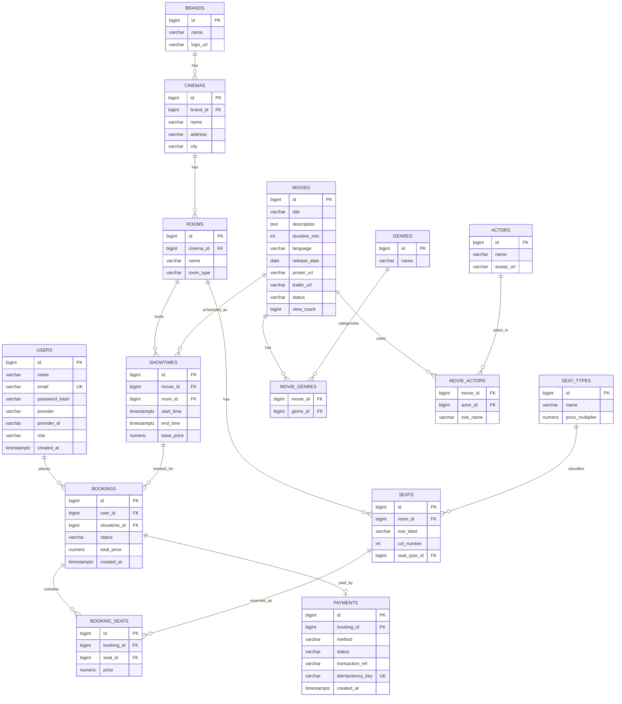

# ERD - Cinema Booking System (Giai đoạn 1: Monolith)

Sơ đồ dưới đây dùng cú pháp Mermaid — GitHub sẽ tự render thành hình khi bạn
mở file này trên web (không cần cài gì thêm). Nếu xem trong VS Code, cài
extension "Markdown Preview Mermaid Support" để thấy hình khi preview.

## Giải thích quan hệ chính

- **Brand → Cinema → Room → Seat**: 1 hãng (VD: BHD) có nhiều rạp (chi nhánh),
  1 rạp có nhiều phòng chiếu, 1 phòng có nhiều ghế.
- **Movie ↔ Genre**, **Movie ↔ Actor**: quan hệ nhiều-nhiều qua bảng trung gian
  `movie_genres` / `movie_actors`.
- **Showtime**: gắn 1 Movie với 1 Room tại 1 khung giờ cụ thể — đây là đối
  tượng trung tâm mà user chọn để xem sơ đồ ghế.
- **Booking → BookingSeat**: 1 booking có thể chứa nhiều ghế (đi nhóm bạn/gia
  đình), mỗi `BookingSeat` là 1 dòng vé với giá tại thời điểm đặt (không tham
  chiếu ngược `base_price` phòng khi giá thay đổi sau này).
- **Booking → Payment**: quan hệ 1-1 (mỗi booking có tối đa 1 payment thành
  công; `idempotency_key` là unique để chống double-charge khi client gọi lại
  API thanh toán).

## Vai trò từng bảng

Giải thích chi tiết từng bảng làm nhiệm vụ gì trong hệ thống, nhóm theo
4 mảng nghiệp vụ. "Trạng thái tầng Java" cho biết bảng đã có
entity/CRUD (`src/main/java/...`) hay mới chỉ tồn tại trong schema chờ
tính năng sau dùng tới (xem checklist ở `ROADMAP.md`).

### Nhóm rạp — hãng / rạp / phòng / ghế

- **`brands`** — hãng chiếu phim (VD: CGV, BHD Star). Là gốc của nhánh
  phân cấp rạp: 1 hãng có nhiều rạp. Phục vụ màn hình "Chọn hãng/rạp"
  (tab "Chọn rạp", màn hình 1). *Trạng thái: CRUD đầy đủ
  (`/api/admin/brands`) + đọc public (`/api/brands`).*
- **`cinemas`** — 1 rạp cụ thể (chi nhánh) thuộc 1 `brand`, có địa chỉ
  và thành phố để sau này lọc "rạp gần tôi" hoặc theo thành phố. *Trạng
  thái: CRUD đầy đủ (`/api/admin/cinemas`) + đọc public theo hãng
  (`/api/brands/{brandId}/cinemas`).*
- **`rooms`** — 1 phòng chiếu thuộc 1 `cinema`, có `room_type` (2D/3D/
  IMAX...) tự do (không ràng buộc `CHECK` như `movies.status`). Là đơn
  vị vật lý chứa ghế và được gắn với suất chiếu. *Trạng thái: CRUD đầy
  đủ (`/api/admin/rooms`), chưa có API public riêng (chỉ lộ ra gián
  tiếp qua `roomName` trong response của Showtime).*
- **`seat_types`** — loại ghế (STANDARD/VIP/COUPLE...), mỗi loại có
  `price_multiplier` nhân vào `base_price` của suất chiếu để ra giá
  từng ghế (VD: VIP x1.5). Seed sẵn 3 loại ở `V2__seed_reference_data.sql`.
  *Trạng thái: CRUD đầy đủ (`/api/admin/seat-types`).*
- **`seats`** — từng ghế cụ thể thuộc 1 `room`, gắn 1 `seat_type`.
  `row_label` + `col_number` (VD: "C", 5) xác định vị trí trên sơ đồ,
  ràng buộc `UNIQUE(room_id, row_label, col_number)` chống trùng vị trí.
  Không có CRUD từng ghế lẻ — chỉ có API "sinh theo sơ đồ phòng" (ghi đè
  toàn bộ ghế của phòng theo danh sách hàng). *Trạng thái:
  `POST/GET /api/admin/rooms/{roomId}/seats`.*

### Nhóm phim — phim / thể loại / diễn viên

- **`movies`** — thông tin phim: tiêu đề, mô tả, thời lượng, ngôn ngữ,
  ngày phát hành, poster/trailer, `status` (`NOW_SHOWING`/
  `COMING_SOON`/`ENDED`), và `view_count` dùng để xếp hạng "phim nổi
  bật" ở trang chủ. *Trạng thái: CRUD đầy đủ (`/api/admin/movies`) +
  đọc public đầy đủ (`/api/movies`, lọc theo status/tìm kiếm/nổi bật,
  chi tiết theo id).*
- **`genres`** — danh mục thể loại phim (Hành Động, Hài...), tên
  `UNIQUE`. *Trạng thái: CRUD đầy đủ (`/api/admin/genres`).*
- **`movie_genres`** — bảng nối nhiều-nhiều `movies` ↔ `genres`, không
  mang thêm dữ liệu riêng nên tầng Java map bằng `@ManyToMany` thuần
  (`Movie.genres`), không có entity riêng.
- **`actors`** — diễn viên, có `avatar_url`. *Trạng thái: CRUD đầy đủ
  (`/api/admin/actors`).*
- **`movie_actors`** — bảng nối `movies` ↔ `actors`, có thêm cột
  `role_name` (vai diễn trong phim đó) nên **không** dùng
  `@ManyToMany` thuần được — tầng Java có entity liên kết riêng
  (`MovieCast`, khóa chính ghép `movie_id` + `actor_id`) để mang thêm
  field này.

### Nhóm suất chiếu — cầu nối phim và rạp

- **`showtimes`** — gắn 1 `movie` với 1 `room` tại 1 khung giờ cụ thể
  (`start_time`/`end_time`, kiểu `TIMESTAMPTZ`) và giá vé cơ bản
  (`base_price`). Đây là đối tượng **trung tâm** của toàn hệ thống đặt
  vé: User chọn 1 showtime là chọn luôn phim + rạp + phòng + giờ + giá
  gốc, từ đó mới suy ra được sơ đồ ghế (qua `room_id`) và giá từng ghế
  (`base_price` × `seat_type.price_multiplier`). *Trạng thái: CRUD đầy
  đủ (`/api/admin/showtimes`) + đọc public theo rạp/ngày/phim
  (`/api/cinemas/{cinemaId}/showtimes`) và sơ đồ ghế theo suất chiếu
  (`/api/showtimes/{id}/seats`, hiện chỉ có layout + giá, chưa có
  trạng thái còn trống/đã đặt).*

### Nhóm đặt vé & thanh toán — chưa làm ở tầng Java

- **`users`** — tài khoản (khách hàng lẫn admin), hỗ trợ đăng nhập
  thường (`password_hash`) và Google OAuth (`provider`,
  `provider_id`), phân quyền qua cột `role` đơn giản (`USER`/`ADMIN`).
  *Trạng thái: chỉ có trong schema, chưa có entity/CRUD — sẽ dùng khi
  làm Spring Security + JWT (mục cuối checklist Giai đoạn 1).*
- **`bookings`** — 1 đơn đặt vé: `user` nào đặt, cho `showtime` nào,
  trạng thái (`PENDING`/`PAID`/`CANCELLED`/`EXPIRED`), tổng tiền
  (`total_price`). Là bảng trung tâm của "Luồng Booking" — mục tiếp
  theo trong checklist. *Trạng thái: chỉ có trong schema, chưa có
  entity/CRUD.*
- **`booking_seats`** — chi tiết từng ghế trong 1 booking (1 booking có
  thể chứa nhiều ghế — đi nhóm bạn/gia đình). Lưu `price` tại **thời
  điểm đặt** (không tham chiếu ngược `base_price` của showtime lúc
  truy vấn sau này), để giá vé cũ không bị thay đổi nếu rạp sau này
  chỉnh giá suất chiếu đó. *Trạng thái: chỉ có trong schema.*
- **`payments`** — thanh toán cho 1 booking (quan hệ 1-1, mỗi booking
  tối đa 1 payment thành công), có `idempotency_key` (`UNIQUE`) để
  chống trừ tiền 2 lần khi client gọi lại API thanh toán (mạng lag,
  người dùng bấm 2 lần...). *Trạng thái: chỉ có trong schema — sẽ dùng
  ở "Payment giả lập" (mục sau Luồng Booking trong checklist).*

## Có chủ đích KHÔNG có trong ERD này

- **Seat-hold (giữ ghế tạm)**: không phải bảng trong Postgres — sẽ là key
  Redis dạng `seat:{showtimeId}:{seatId}` có TTL, làm ở Tuần 3. Bản chất dữ
  liệu tạm thời/ephemeral nên không thuộc schema quan hệ.
- **Roles chi tiết (permission-based)**: hiện dùng 1 cột `role` đơn giản
  (`USER`/`ADMIN`) trong `users`, đủ cho Giai đoạn 1. Tách bảng `roles` +
  `permissions` riêng chỉ cần khi hệ thống phân quyền phức tạp hơn.

## Deferred constraints (sẽ thêm sau, không phải bây giờ)

- **Chống bán trùng ghế ở tầng DB**: một partial unique index trên
  `booking_seats(showtime_id, seat_id)` giới hạn trong các booking đã `PAID`
  — đóng vai trò "lưới an toàn cuối cùng" phía sau Redis seat-hold. Cần thêm
  cột `showtime_id` (denormalize) vào `booking_seats` trước khi làm — để dành
  cho Tuần 3, lúc đó business logic concurrency đã rõ ràng hơn.
