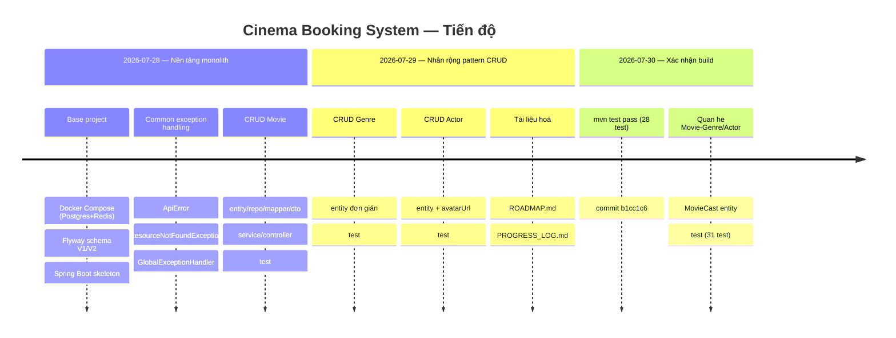

# Nhật ký tiến độ chi tiết

> File này ghi **chi tiết từng task đã làm**: làm gì, để làm gì (mục
> đích), làm như thế nào (quyết định kỹ thuật đáng chú ý), và trạng thái
> test. Bức tranh tổng quan (mục tiêu, giai đoạn, sắp làm gì) nằm ở
> [`ROADMAP.md`](./ROADMAP.md) — đừng lặp lại nội dung đó ở đây.
>
> **Quy ước:** entry mới thêm vào **cuối file**, theo thứ tự thời gian
> tăng dần (task cũ nhất ở trên, mới nhất ở dưới). Mỗi entry dùng
> template ở mục "Cách thêm entry mới" phía cuối file. Nhớ thêm 1 dòng
> vào sơ đồ timeline bên dưới mỗi khi thêm entry mới.

## Timeline



Xem chi tiết từng mốc ở các mục bên dưới (bấm vào tiêu đề để mở rộng).

---

<details>
<summary><strong>2026-07-28 — Base project: Docker Compose, Flyway schema, Spring Boot skeleton</strong> — nền tảng chạy được đầu tiên, có sẵn schema cho toàn Giai đoạn 1</summary>

**Mục đích:** có một project chạy được ngay từ ngày đầu (health check
sống), và có sẵn schema DB đầy đủ cho toàn bộ Giai đoạn 1 để không phải
sửa đi sửa lại migration khi thêm entity mới.

**Đã làm:**
- `docker-compose.yml`: Postgres 16 + Redis 7, có healthcheck, biến
  môi trường đọc từ `.env` (`DB_NAME`, `DB_USERNAME`, `DB_PASSWORD`,
  `DB_PORT`, `REDIS_PORT`). Redis được setup từ bây giờ dù chưa dùng,
  để Giai đoạn 3 (seat-hold) không phải cấu hình lại.
- `src/main/resources/db/migration/V1__init_schema.sql`: tạo toàn bộ 14
  bảng cho Giai đoạn 1 — `users, brands, cinemas, rooms, seat_types,
  seats, movies, genres, movie_genres, actors, movie_actors, showtimes,
  bookings, booking_seats, payments`. Index cho các cột FK hay dùng để
  filter/join (`cinemas.brand_id`, `rooms.cinema_id`, `seats.room_id`,
  `showtimes.movie_id`, `showtimes(room_id, start_time)`,
  `bookings.user_id`, `bookings.showtime_id`, `booking_seats.booking_id`,
  `booking_seats.seat_id`, `payments.booking_id`).
- `src/main/resources/db/migration/V2__seed_reference_data.sql`: seed
  dữ liệu tham chiếu (chưa đọc chi tiết trong lần review này — xem file
  trực tiếp nếu cần).
- `src/main/resources/application.yml`: `hibernate.ddl-auto: validate`
  (Hibernate **không** được tự tạo/sửa schema — Flyway là nguồn sự thật
  duy nhất; nếu Entity lệch với DB, app báo lỗi ngay lúc start thay vì
  âm thầm sinh sai).
- `CinemaBookingApplication.java`, `controller/HealthController.java` —
  endpoint `/api/health` để xác nhận app chạy.
- `docs/ERD.md` — sơ đồ ERD dạng Mermaid, kèm giải thích quan hệ chính
  và ghi chú các ràng buộc **cố tình chưa làm** ở giai đoạn này (seat-hold
  bằng Redis thay vì bảng SQL; partial unique index chống bán trùng ghế
  — để dành Giai đoạn 2 khi business logic concurrency rõ ràng hơn).
- `pom.xml`: Spring Boot 3.3.4, Java 21, dependencies: `web`,
  `validation`, `data-jpa`, `postgresql` driver, `flyway-core` +
  `flyway-database-postgresql`, `lombok`, `springdoc-openapi` (Swagger
  UI để test API thay Postman), `devtools`.

**Test:** `HealthControllerTest` — test thuần, không cần Postgres/Redis
đang chạy.

**Trạng thái:** đã commit (`126e2fa first commit`, `f2e8d26 first commit
Base`).

</details>

<details>
<summary><strong>2026-07-28 — Common exception handling</strong> — 1 nơi xử lý lỗi thống nhất cho toàn bộ REST API</summary>

**Mục đích:** có 1 nơi xử lý lỗi thống nhất cho toàn bộ REST API, để
mọi module CRUD sau này (Movie, Genre, Actor, Cinema...) tái sử dụng —
không viết try/catch lặp lại trong từng controller.

**Đã làm:**
- `common/exception/ApiError.java` — record response lỗi chuẩn:
  `timestamp, status, message, fieldErrors` (map field → message lỗi
  validate). Có 2 static factory `ApiError.of(status, message)` và
  `ApiError.of(status, message, fieldErrors)`.
- `common/exception/ResourceNotFoundException.java` — `RuntimeException`
  để Service ném khi không tìm thấy entity theo id. Controller không
  cần biết gì về HTTP status.
- `common/exception/GlobalExceptionHandler.java` — `@RestControllerAdvice`
  toàn cục, bắt `ResourceNotFoundException` → 404, bắt
  `MethodArgumentNotValidException` (lỗi `@Valid` trên DTO) → 400 kèm
  `fieldErrors`.

**Quyết định kỹ thuật:** đặt exception handling ở `common/`, tách khỏi
package nghiệp vụ (`movie`, `genre`...) vì đây là hạ tầng dùng chung,
không thuộc riêng entity nào.

**Test:** chưa có test riêng cho `GlobalExceptionHandler` — được test
gián tiếp qua các test controller của từng module (VD:
`MovieControllerTest.findById_returns404WhenMissing`).

**Trạng thái:** chưa commit (untracked).

</details>

<details>
<summary><strong>2026-07-28 — CRUD Movie (<code>/api/admin/movies</code>)</strong> — entity nghiệp vụ đầu tiên, làm mẫu pattern CRUD chuẩn</summary>

**Mục đích:** entity nghiệp vụ đầu tiên của Giai đoạn 1, đồng thời làm
**mẫu pattern CRUD chuẩn** để copy sang các entity tĩnh khác (Genre,
Actor, và sau này Cinema, Room...).

**Đã làm:**
- `movie/Movie.java` — entity map bảng `movies`: `title` (not null),
  `description` (TEXT), `durationMin`, `language`, `releaseDate`,
  `posterUrl`, `trailerUrl`, `status` (enum, mặc định `COMING_SOON`),
  `viewCount` (mặc định 0, dùng cho bảng xếp hạng "phim nổi bật" ở màn
  hình 1 tab "Chọn phim").
- `movie/MovieStatus.java` — enum `NOW_SHOWING / COMING_SOON / ENDED`,
  map bằng `@Enumerated(EnumType.STRING)` để khớp `CHECK constraint`
  trên cột `movies.status` (lưu tên, không lưu ordinal).
- `movie/MovieRepository.java` — `JpaRepository<Movie, Long>` +
  derived query `findByStatus(MovieStatus)` (dùng cho API public sau
  này: danh sách phim đang chiếu/sắp chiếu).
- `movie/dto/MovieRequest.java` / `dto/MovieResponse.java` — **tách
  riêng DTO input/output**: `MovieRequest` không có `viewCount` vì đó
  là field server-controlled, form nhập từ Admin không được phép quyết
  định giá trị này. Validate bằng `@NotBlank`, `@NotNull`, `@Positive`
  với message tiếng Việt.
- `movie/MovieMapper.java` — mapper **viết tay**, không dùng MapStruct,
  để thấy rõ từng field đang map gì (quyết định có ghi chú lại: khi số
  field nhiều lên ở entity sau — Cinema, Room — có thể cân nhắc
  MapStruct).
- `movie/MovieService.java` — CRUD đầy đủ; `update()` **không gọi**
  `repository.save()` vì entity lấy từ `findById` trong transaction
  đang ở trạng thái managed — Hibernate tự UPDATE khi commit (dirty
  checking), gọi `save()` thêm là thừa.
- `movie/MovieController.java` — REST tại `/api/admin/movies` (namespace
  `/api/admin/...` để tách riêng với endpoint public `/api/movies` sẽ
  làm sau cho màn hình user xem phim). Chưa có Spring Security nên
  chưa có `@PreAuthorize` — sẽ thêm `hasRole("ADMIN")` khi làm JWT.

**Test:**
- `MovieServiceTest` (Mockito thuần, không `@SpringBootTest`, không cần
  Postgres chạy): create lưu đúng entity từ request, `findById`/`delete`
  ném `ResourceNotFoundException` khi không tồn tại, `update` áp giá trị
  mới đúng.
- `MovieControllerTest` (`@WebMvcTest` — chỉ load layer web, mock
  `MovieService` bằng `@MockBean`): create trả 201, validate lỗi trả
  400 kèm `fieldErrors`, `findById` không tồn tại trả 404, `delete` trả
  204.

**Trạng thái:** chưa commit (untracked).

</details>

<details>
<summary><strong>2026-07-29 — CRUD Genre (<code>/api/admin/genres</code>)</strong> — entity đơn giản, verify pattern Movie tái sử dụng tốt</summary>

**Mục đích:** entity thứ 2, đơn giản hơn Movie (chỉ `id` + `name`
unique), dùng để verify pattern CRUD ở Movie có tái sử dụng tốt không
trước khi nhân rộng cho các entity còn lại. Cần có trước khi nối quan
hệ `movie_genres`.

**Đã làm:** cấu trúc y hệt Movie —
`genre/Genre.java` (entity, `name varchar(50) unique not null`),
`genre/GenreRepository.java`, `genre/GenreMapper.java`,
`genre/dto/GenreRequest.java` (`@NotBlank`, `@Size(max = 50)`),
`genre/dto/GenreResponse.java`, `genre/GenreService.java` (CRUD +
`ResourceNotFoundException`), `genre/GenreController.java`
(`/api/admin/genres`).

**Quyết định kỹ thuật:** không thêm xử lý riêng cho lỗi trùng `name`
(DB có `UNIQUE`, nhưng chưa bắt `DataIntegrityViolationException`) —
để nguyên vì Movie cũng chưa xử lý case tương tự, giữ pattern nhất
quán; sẽ xử lý đồng loạt cho mọi entity khi cần (không làm riêng lẻ
từng module).

**Test:** `GenreServiceTest`, `GenreControllerTest` — cùng cấu trúc
test như Movie (Mockito cho Service, `@WebMvcTest` cho Controller).

**Trạng thái:** đã commit (`b1cc1c6`). `mvn test` pass (dùng Maven 3
bundle sẵn trong IntelliJ, `plugins/maven/lib/maven3/bin`, vì máy này
không có `mvn` cài rời trên PATH).

</details>

<details>
<summary><strong>2026-07-29 — CRUD Actor (<code>/api/admin/actors</code>)</strong> — tương tự Genre, thêm field avatarUrl</summary>

**Mục đích:** entity thứ 3, tương tự Genre nhưng có thêm field
`avatarUrl` (không unique). Cần có trước khi nối quan hệ
`movie_actors` (diễn viên + vai diễn trong phim, hiển thị ở màn hình
"Chi tiết phim").

**Đã làm:** cấu trúc y hệt Genre —
`actor/Actor.java` (entity, `name varchar(150) not null`,
`avatarUrl varchar(500)` nullable), `actor/ActorRepository.java`,
`actor/ActorMapper.java`, `actor/dto/ActorRequest.java` (`@NotBlank`,
`@Size(max = 150)` cho `name`; `avatarUrl` không validate vì optional),
`actor/dto/ActorResponse.java`, `actor/ActorService.java`,
`actor/ActorController.java` (`/api/admin/actors`).

**Test:** `ActorServiceTest`, `ActorControllerTest` — cùng cấu trúc
test như Movie/Genre.

**Trạng thái:** đã commit (`b1cc1c6`). `mvn test` pass.

</details>

<details>
<summary><strong>2026-07-29 — Tài liệu hoá roadmap và nhật ký tiến độ</strong> — ROADMAP.md + PROGRESS_LOG.md</summary>

**Mục đích:** có tài liệu để bất kỳ ai (kể cả người mới, hoặc chính tác
giả sau vài tuần quay lại) nhìn vào là hiểu tổng quan dự án đang ở đâu,
và tra được chi tiết từng task đã làm mà không phải đọc lại toàn bộ
code/git history.

**Đã làm:**
- `docs/ROADMAP.md` — tổng quan: mục tiêu, luồng UX 2 tab (Chọn
  phim / Chọn rạp) với chi tiết từng màn hình, tech stack và lý do dùng,
  5 giai đoạn của dự án (Monolith → Concurrency & Transaction → File &
  Payment → Microservice & Saga → Deploy & CI/CD) kèm checklist, và
  snapshot đang làm tới đâu.
- `docs/PROGRESS_LOG.md` (file này) — nhật ký chi tiết từng task, viết
  lại lịch sử từ base project đến Actor CRUD dựa trên code hiện có
  (git log chỉ có 2 commit gộp "first commit" nên không tách được mốc
  thời gian chi tiết hơn từ git — dùng timestamp file làm mốc tương đối).

**Trạng thái:** đã commit (`b1cc1c6`).

</details>

<details>
<summary><strong>2026-07-29 — Thêm timeline trực quan cho file này</strong> — Mermaid timeline + gói chi tiết vào khối gấp gọn</summary>

**Mục đích:** bản đầu của `PROGRESS_LOG.md` toàn text dài, khó lướt để
nắm tổng quan tiến độ. Cần 1 hình ảnh trực quan xem "đã làm gì theo thứ
tự thời gian" mà không phải đọc hết mọi đoạn văn.

**Đã làm:** thêm sơ đồ `mermaid timeline` ở đầu file (GitHub tự render
thành hình), nhóm theo ngày và giai đoạn; gói nội dung chi tiết của mỗi
entry cũ vào `<details><summary>` để mặc định thu gọn, chỉ hiện dòng
tóm tắt — bấm vào mới xem đầy đủ Mục đích/Đã làm/Test/Trạng thái.

**Trạng thái:** đã commit (`b1cc1c6`).

</details>

<details>
<summary><strong>2026-07-30 — Xác nhận build, commit lô CRUD đầu tiên</strong> — cài Maven qua bundle IntelliJ, `mvn test` pass, commit Movie/Genre/Actor/common</summary>

**Mục đích:** giải phóng điểm nghẽn "chưa xác nhận build" đã ghi ở các
entry trước, để có thể commit và yên tâm rẽ nhánh tiếp theo trên nền
code đã biết chắc chạy được.

**Đã làm:** phát hiện máy này không có `mvn` hay Maven Wrapper trên
PATH, nhưng có sẵn JDK 21 và Maven 3.9.11 bundle theo IntelliJ IDEA
(`.../plugins/maven/lib/maven3/bin`) — dùng trực tiếp thay vì cài thêm.
Chạy `mvn test`: 28 test, 0 fail/error, `BUILD SUCCESS`. Commit toàn bộ
`common/`, `actor/`, `genre/`, `movie/` (main + test) và 2 file doc
(`b1cc1c6`).

**Test:** không thêm test mới — chỉ xác nhận 28 test đã có (Movie,
Genre, Actor: Service + Controller, và `HealthControllerTest`) đều pass.

**Trạng thái:** đã commit (`b1cc1c6`).

</details>

<details>
<summary><strong>2026-07-30 — Nối quan hệ nhiều-nhiều Movie ↔ Genre / Movie ↔ Actor</strong> — MovieCast entity cho movie_actors, @ManyToMany cho movie_genres</summary>

**Mục đích:** màn hình "Chi tiết phim" (mục 3, `ROADMAP.md`) cần hiển thị
thể loại và dàn diễn viên/vai diễn — bảng `movie_genres`, `movie_actors`
đã có sẵn từ V1 nhưng chưa có liên kết ở tầng Java. Bắt buộc phải xong
trước khi làm Showtime/Booking.

**Đã làm:**
- `movie_genres` (thuần, không có cột riêng) → `Movie.genres` là
  `@ManyToMany` với `@JoinTable`, một chiều (không thêm `Genre.movies`
  vì chưa có màn hình nào cần).
- `movie_actors` (có thêm cột `role_name` gắn với từng cặp) → không
  dùng `@ManyToMany` được vì nó không mang thêm dữ liệu trên quan hệ.
  Tạo entity liên kết riêng: `movie/MovieCastId.java` (`@Embeddable`,
  khóa chính ghép `movieId` + `actorId`) và `movie/MovieCast.java`
  (`@EmbeddedId`, `@ManyToOne @MapsId` tới `Movie` và `Actor`, field
  `roleName`). `Movie.cast` là `@OneToMany(cascade = ALL, orphanRemoval
  = true)` để Service chỉ cần `clear()` + `addAll()` là Hibernate tự xoá
  dòng cũ/thêm dòng mới.
- `movie/dto/MovieCastRequest.java` (`actorId`, `roleName`),
  `movie/dto/MovieCastResponse.java` (phẳng hoá — `actorId, actorName,
  avatarUrl, roleName` — để FE không phải lồng `ActorResponse`).
  `MovieRequest` thêm `genreIds`, `cast` (không bắt buộc — phim mới có
  thể chưa gán gì). `MovieResponse` thêm `genres`, `cast`.
- `MovieMapper` giữ nguyên style hàm tĩnh thuần — không tự query DB,
  chỉ lắp ráp entity đã resolve sẵn (`toMovieCast`, `toResponse` mở
  rộng map thêm `genres`/`cast`).
- `MovieService`: tiêm thêm `GenreRepository`, `ActorRepository`;
  `resolveGenres`/`resolveCast` dùng `findAllById` (1 query, tránh N+1),
  ném `ResourceNotFoundException` nếu có id không tồn tại. `create()`/
  `update()` theo kiểu **replace-all**: mỗi lần gửi request là ghi đè
  toàn bộ genres/cast cũ.

**Quyết định kỹ thuật:**
- `create()` phải gọi `movieRepository.save(movie)` **trước** khi build
  `MovieCast` — `movies.id` dùng chiến lược `IDENTITY`, chỉ có giá trị
  sau khi insert, mà `MovieCastId` cần `movie.getId()` để dựng khóa
  chính ghép.
- Cố tình không thêm chiều ngược (`Genre.movies`, `Actor.movies`) và
  không tối ưu N+1 khi `findAll()` load quan hệ của nhiều phim cùng lúc
  (`@EntityGraph`/fetch join) — chưa có nhu cầu thật, để dành khi có vấn
  đề hiệu năng cụ thể.

**Test:** `MovieServiceTest` thêm mock `GenreRepository`,
`ActorRepository`; test case mới `create_resolvesGenresAndCast`,
`create_throwsWhenGenreIdNotFound`, `update_replacesExistingCastAndGenres`.
`MovieControllerTest` cập nhật request/response mẫu cho có `genreIds`,
`cast`. Tổng `mvn test`: 31 test, 0 fail/error, `BUILD SUCCESS`.

**Trạng thái:** đã commit (`d7f37b4`).

</details>

---

## Cách thêm entry mới

Copy template dưới đây, điền vào cuối file này (không chèn giữa các
entry cũ), rồi:
1. Thêm 1 dòng tương ứng vào sơ đồ `mermaid timeline` ở đầu file (theo
   đúng ngày, tạo `section` mới nếu sang giai đoạn khác).
2. Cập nhật checklist tương ứng trong `ROADMAP.md` nếu task này hoàn
   thành 1 mục ở đó.

```markdown
<details>
<summary><strong>YYYY-MM-DD — Tên task ngắn gọn</strong> — 1 dòng tóm tắt hiện ra khi thu gọn</summary>

**Mục đích:** tại sao làm task này, nó phục vụ tính năng/màn hình nào.

**Đã làm:** liệt kê file/module đã tạo hoặc sửa, mỗi cái 1 dòng, nói rõ
field/behavior quan trọng — không chỉ liệt kê tên file.

**Quyết định kỹ thuật:** (nếu có) lựa chọn nào đã cân nhắc, tại sao chọn
cách này chứ không phải cách khác. Bỏ mục này nếu task không có quyết
định đáng nói.

**Test:** test nào đã viết, cover case gì.

**Trạng thái:** đã commit (kèm hash) / chưa commit / đã chạy `mvn test`
pass hay chưa.

</details>
```
