# Nhật ký tiến độ chi tiết

> File này ghi **chi tiết từng task đã làm**: làm gì, để làm gì (mục
> đích), làm như thế nào (quyết định kỹ thuật đáng chú ý), và trạng thái
> test. Bức tranh tổng quan (mục tiêu, giai đoạn, sắp làm gì) nằm ở
> [`ROADMAP.md`](./ROADMAP.md) — đừng lặp lại nội dung đó ở đây.
>
> **Quy ước:** entry mới thêm vào **cuối file**, theo thứ tự thời gian
> tăng dần (task cũ nhất ở trên, mới nhất ở dưới). Mỗi entry dùng
> template ở mục "Cách thêm entry mới" phía cuối file. Nhớ thêm 1 dòng
> vào sơ đồ timeline bên dưới mỗi khi thêm entry mới.

## Timeline

```mermaid
timeline
    title Cinema Booking System — Tiến độ
    section 2026-07-28 — Nền tảng monolith
        Base project : Docker Compose (Postgres+Redis) : Flyway schema V1/V2 : Spring Boot skeleton
        Common exception handling : ApiError : ResourceNotFoundException : GlobalExceptionHandler
        CRUD Movie : entity/repo/mapper/dto : service/controller : test
    section 2026-07-29 — Nhân rộng pattern CRUD
        CRUD Genre : entity đơn giản : test
        CRUD Actor : entity + avatarUrl : test
        Tài liệu hoá : ROADMAP.md : PROGRESS_LOG.md
    section 2026-07-30 — Xác nhận build
        mvn test pass (28 test) : commit b1cc1c6
        Quan he Movie-Genre/Actor : MovieCast entity : test (31 test)
        Brand-Cinema-Room-SeatType-Seat : sinh so do ghe : test (77 test)
    section 2026-08-01 — Showtime
        CRUD Showtime : gan Movie + Room : test (88 test)
        API public cho User : movies/brands/cinemas/showtimes/seat-map : test (109 test)
        Seed data test (V3) + Postman collection : 52 request, chain qua bien
    section 2026-08-03 — Luong Booking
        CRUD-nho Booking : User entity toi thieu : create/get/history/cancel : check trung ghe app-level : test (126 test)
    section 2026-08-04 — Payment gia lap
        Payment bypass : idempotency_key chong double-charge : booking PENDING - PAID : ticket_code + QR that (ZXing) : test (139 test)
        Postman - Payment folder : pay/replay/get ticket
    section 2026-08-05 — Spring Security + JWT
        JWT login thuong : register/login : UserRole enum : SecurityFilterChain permitAll/authenticated/hasRole(ADMIN)
        Booking/Payment dung JWT principal thay userId client-supplied : ownership check 404 : test (160 test)
        Postman - Auth folder : bearer {{authToken}}/{{adminAuthToken}} ke thua/override theo folder
        Admin quan ly User : cot active : lock/unlock/doi role : chan self-lockout (409)
        Admin quan ly Booking : xem/loc/huy booking moi user : tai dung BookingService : test (185 test)
    section 2026-08-06 — Quen mat khau + Google SSO (het Giai doan 1)
        Quen/dat lai mat khau (luong thuong) : password_reset_tokens (Postgres, TTL 30p) : gui "email" bang log console : test (195 test)
        Login Google/SSO : ID token flow : GoogleTokenVerifierService : auto-link user LOCAL theo email da xac minh : test (203 test)
```



Xem chi tiết từng mốc ở các mục bên dưới (bấm vào tiêu đề để mở rộng).

---

<details>
<summary><strong>2026-07-28 — Base project: Docker Compose, Flyway schema, Spring Boot skeleton</strong> — nền tảng chạy được đầu tiên, có sẵn schema cho toàn Giai đoạn 1</summary>

**Mục đích:** có một project chạy được ngay từ ngày đầu (health check
sống), và có sẵn schema DB đầy đủ cho toàn bộ Giai đoạn 1 để không phải
sửa đi sửa lại migration khi thêm entity mới.

**Đã làm:**
- `docker-compose.yml`: Postgres 16 + Redis 7, có healthcheck, biến
  môi trường đọc từ `.env` (`DB_NAME`, `DB_USERNAME`, `DB_PASSWORD`,
  `DB_PORT`, `REDIS_PORT`). Redis được setup từ bây giờ dù chưa dùng,
  để Giai đoạn 3 (seat-hold) không phải cấu hình lại.
- `src/main/resources/db/migration/V1__init_schema.sql`: tạo toàn bộ 14
  bảng cho Giai đoạn 1 — `users, brands, cinemas, rooms, seat_types,
  seats, movies, genres, movie_genres, actors, movie_actors, showtimes,
  bookings, booking_seats, payments`. Index cho các cột FK hay dùng để
  filter/join (`cinemas.brand_id`, `rooms.cinema_id`, `seats.room_id`,
  `showtimes.movie_id`, `showtimes(room_id, start_time)`,
  `bookings.user_id`, `bookings.showtime_id`, `booking_seats.booking_id`,
  `booking_seats.seat_id`, `payments.booking_id`).
- `src/main/resources/db/migration/V2__seed_reference_data.sql`: seed
  dữ liệu tham chiếu (chưa đọc chi tiết trong lần review này — xem file
  trực tiếp nếu cần).
- `src/main/resources/application.yml`: `hibernate.ddl-auto: validate`
  (Hibernate **không** được tự tạo/sửa schema — Flyway là nguồn sự thật
  duy nhất; nếu Entity lệch với DB, app báo lỗi ngay lúc start thay vì
  âm thầm sinh sai).
- `CinemaBookingApplication.java`, `controller/HealthController.java` —
  endpoint `/api/health` để xác nhận app chạy.
- `docs/ERD.md` — sơ đồ ERD dạng Mermaid, kèm giải thích quan hệ chính
  và ghi chú các ràng buộc **cố tình chưa làm** ở giai đoạn này (seat-hold
  bằng Redis thay vì bảng SQL; partial unique index chống bán trùng ghế
  — để dành Giai đoạn 2 khi business logic concurrency rõ ràng hơn).
- `pom.xml`: Spring Boot 3.3.4, Java 21, dependencies: `web`,
  `validation`, `data-jpa`, `postgresql` driver, `flyway-core` +
  `flyway-database-postgresql`, `lombok`, `springdoc-openapi` (Swagger
  UI để test API thay Postman), `devtools`.

**Test:** `HealthControllerTest` — test thuần, không cần Postgres/Redis
đang chạy.

**Trạng thái:** đã commit (`126e2fa first commit`, `f2e8d26 first commit
Base`).

</details>

<details>
<summary><strong>2026-07-28 — Common exception handling</strong> — 1 nơi xử lý lỗi thống nhất cho toàn bộ REST API</summary>

**Mục đích:** có 1 nơi xử lý lỗi thống nhất cho toàn bộ REST API, để
mọi module CRUD sau này (Movie, Genre, Actor, Cinema...) tái sử dụng —
không viết try/catch lặp lại trong từng controller.

**Đã làm:**
- `common/exception/ApiError.java` — record response lỗi chuẩn:
  `timestamp, status, message, fieldErrors` (map field → message lỗi
  validate). Có 2 static factory `ApiError.of(status, message)` và
  `ApiError.of(status, message, fieldErrors)`.
- `common/exception/ResourceNotFoundException.java` — `RuntimeException`
  để Service ném khi không tìm thấy entity theo id. Controller không
  cần biết gì về HTTP status.
- `common/exception/GlobalExceptionHandler.java` — `@RestControllerAdvice`
  toàn cục, bắt `ResourceNotFoundException` → 404, bắt
  `MethodArgumentNotValidException` (lỗi `@Valid` trên DTO) → 400 kèm
  `fieldErrors`.

**Quyết định kỹ thuật:** đặt exception handling ở `common/`, tách khỏi
package nghiệp vụ (`movie`, `genre`...) vì đây là hạ tầng dùng chung,
không thuộc riêng entity nào.

**Test:** chưa có test riêng cho `GlobalExceptionHandler` — được test
gián tiếp qua các test controller của từng module (VD:
`MovieControllerTest.findById_returns404WhenMissing`).

**Trạng thái:** chưa commit (untracked).

</details>

<details>
<summary><strong>2026-07-28 — CRUD Movie (<code>/api/admin/movies</code>)</strong> — entity nghiệp vụ đầu tiên, làm mẫu pattern CRUD chuẩn</summary>

**Mục đích:** entity nghiệp vụ đầu tiên của Giai đoạn 1, đồng thời làm
**mẫu pattern CRUD chuẩn** để copy sang các entity tĩnh khác (Genre,
Actor, và sau này Cinema, Room...).

**Đã làm:**
- `movie/Movie.java` — entity map bảng `movies`: `title` (not null),
  `description` (TEXT), `durationMin`, `language`, `releaseDate`,
  `posterUrl`, `trailerUrl`, `status` (enum, mặc định `COMING_SOON`),
  `viewCount` (mặc định 0, dùng cho bảng xếp hạng "phim nổi bật" ở màn
  hình 1 tab "Chọn phim").
- `movie/MovieStatus.java` — enum `NOW_SHOWING / COMING_SOON / ENDED`,
  map bằng `@Enumerated(EnumType.STRING)` để khớp `CHECK constraint`
  trên cột `movies.status` (lưu tên, không lưu ordinal).
- `movie/MovieRepository.java` — `JpaRepository<Movie, Long>` +
  derived query `findByStatus(MovieStatus)` (dùng cho API public sau
  này: danh sách phim đang chiếu/sắp chiếu).
- `movie/dto/MovieRequest.java` / `dto/MovieResponse.java` — **tách
  riêng DTO input/output**: `MovieRequest` không có `viewCount` vì đó
  là field server-controlled, form nhập từ Admin không được phép quyết
  định giá trị này. Validate bằng `@NotBlank`, `@NotNull`, `@Positive`
  với message tiếng Việt.
- `movie/MovieMapper.java` — mapper **viết tay**, không dùng MapStruct,
  để thấy rõ từng field đang map gì (quyết định có ghi chú lại: khi số
  field nhiều lên ở entity sau — Cinema, Room — có thể cân nhắc
  MapStruct).
- `movie/MovieService.java` — CRUD đầy đủ; `update()` **không gọi**
  `repository.save()` vì entity lấy từ `findById` trong transaction
  đang ở trạng thái managed — Hibernate tự UPDATE khi commit (dirty
  checking), gọi `save()` thêm là thừa.
- `movie/MovieController.java` — REST tại `/api/admin/movies` (namespace
  `/api/admin/...` để tách riêng với endpoint public `/api/movies` sẽ
  làm sau cho màn hình user xem phim). Chưa có Spring Security nên
  chưa có `@PreAuthorize` — sẽ thêm `hasRole("ADMIN")` khi làm JWT.

**Test:**
- `MovieServiceTest` (Mockito thuần, không `@SpringBootTest`, không cần
  Postgres chạy): create lưu đúng entity từ request, `findById`/`delete`
  ném `ResourceNotFoundException` khi không tồn tại, `update` áp giá trị
  mới đúng.
- `MovieControllerTest` (`@WebMvcTest` — chỉ load layer web, mock
  `MovieService` bằng `@MockBean`): create trả 201, validate lỗi trả
  400 kèm `fieldErrors`, `findById` không tồn tại trả 404, `delete` trả
  204.

**Trạng thái:** chưa commit (untracked).

</details>

<details>
<summary><strong>2026-07-29 — CRUD Genre (<code>/api/admin/genres</code>)</strong> — entity đơn giản, verify pattern Movie tái sử dụng tốt</summary>

**Mục đích:** entity thứ 2, đơn giản hơn Movie (chỉ `id` + `name`
unique), dùng để verify pattern CRUD ở Movie có tái sử dụng tốt không
trước khi nhân rộng cho các entity còn lại. Cần có trước khi nối quan
hệ `movie_genres`.

**Đã làm:** cấu trúc y hệt Movie —
`genre/Genre.java` (entity, `name varchar(50) unique not null`),
`genre/GenreRepository.java`, `genre/GenreMapper.java`,
`genre/dto/GenreRequest.java` (`@NotBlank`, `@Size(max = 50)`),
`genre/dto/GenreResponse.java`, `genre/GenreService.java` (CRUD +
`ResourceNotFoundException`), `genre/GenreController.java`
(`/api/admin/genres`).

**Quyết định kỹ thuật:** không thêm xử lý riêng cho lỗi trùng `name`
(DB có `UNIQUE`, nhưng chưa bắt `DataIntegrityViolationException`) —
để nguyên vì Movie cũng chưa xử lý case tương tự, giữ pattern nhất
quán; sẽ xử lý đồng loạt cho mọi entity khi cần (không làm riêng lẻ
từng module).

**Test:** `GenreServiceTest`, `GenreControllerTest` — cùng cấu trúc
test như Movie (Mockito cho Service, `@WebMvcTest` cho Controller).

**Trạng thái:** đã commit (`b1cc1c6`). `mvn test` pass (dùng Maven 3
bundle sẵn trong IntelliJ, `plugins/maven/lib/maven3/bin`, vì máy này
không có `mvn` cài rời trên PATH).

</details>

<details>
<summary><strong>2026-07-29 — CRUD Actor (<code>/api/admin/actors</code>)</strong> — tương tự Genre, thêm field avatarUrl</summary>

**Mục đích:** entity thứ 3, tương tự Genre nhưng có thêm field
`avatarUrl` (không unique). Cần có trước khi nối quan hệ
`movie_actors` (diễn viên + vai diễn trong phim, hiển thị ở màn hình
"Chi tiết phim").

**Đã làm:** cấu trúc y hệt Genre —
`actor/Actor.java` (entity, `name varchar(150) not null`,
`avatarUrl varchar(500)` nullable), `actor/ActorRepository.java`,
`actor/ActorMapper.java`, `actor/dto/ActorRequest.java` (`@NotBlank`,
`@Size(max = 150)` cho `name`; `avatarUrl` không validate vì optional),
`actor/dto/ActorResponse.java`, `actor/ActorService.java`,
`actor/ActorController.java` (`/api/admin/actors`).

**Test:** `ActorServiceTest`, `ActorControllerTest` — cùng cấu trúc
test như Movie/Genre.

**Trạng thái:** đã commit (`b1cc1c6`). `mvn test` pass.

</details>

<details>
<summary><strong>2026-07-29 — Tài liệu hoá roadmap và nhật ký tiến độ</strong> — ROADMAP.md + PROGRESS_LOG.md</summary>

**Mục đích:** có tài liệu để bất kỳ ai (kể cả người mới, hoặc chính tác
giả sau vài tuần quay lại) nhìn vào là hiểu tổng quan dự án đang ở đâu,
và tra được chi tiết từng task đã làm mà không phải đọc lại toàn bộ
code/git history.

**Đã làm:**
- `docs/ROADMAP.md` — tổng quan: mục tiêu, luồng UX 2 tab (Chọn
  phim / Chọn rạp) với chi tiết từng màn hình, tech stack và lý do dùng,
  5 giai đoạn của dự án (Monolith → Concurrency & Transaction → File &
  Payment → Microservice & Saga → Deploy & CI/CD) kèm checklist, và
  snapshot đang làm tới đâu.
- `docs/PROGRESS_LOG.md` (file này) — nhật ký chi tiết từng task, viết
  lại lịch sử từ base project đến Actor CRUD dựa trên code hiện có
  (git log chỉ có 2 commit gộp "first commit" nên không tách được mốc
  thời gian chi tiết hơn từ git — dùng timestamp file làm mốc tương đối).

**Trạng thái:** đã commit (`b1cc1c6`).

</details>

<details>
<summary><strong>2026-07-29 — Thêm timeline trực quan cho file này</strong> — Mermaid timeline + gói chi tiết vào khối gấp gọn</summary>

**Mục đích:** bản đầu của `PROGRESS_LOG.md` toàn text dài, khó lướt để
nắm tổng quan tiến độ. Cần 1 hình ảnh trực quan xem "đã làm gì theo thứ
tự thời gian" mà không phải đọc hết mọi đoạn văn.

**Đã làm:** thêm sơ đồ `mermaid timeline` ở đầu file (GitHub tự render
thành hình), nhóm theo ngày và giai đoạn; gói nội dung chi tiết của mỗi
entry cũ vào `<details><summary>` để mặc định thu gọn, chỉ hiện dòng
tóm tắt — bấm vào mới xem đầy đủ Mục đích/Đã làm/Test/Trạng thái.

**Trạng thái:** đã commit (`b1cc1c6`).

</details>

<details>
<summary><strong>2026-07-30 — Xác nhận build, commit lô CRUD đầu tiên</strong> — cài Maven qua bundle IntelliJ, `mvn test` pass, commit Movie/Genre/Actor/common</summary>

**Mục đích:** giải phóng điểm nghẽn "chưa xác nhận build" đã ghi ở các
entry trước, để có thể commit và yên tâm rẽ nhánh tiếp theo trên nền
code đã biết chắc chạy được.

**Đã làm:** phát hiện máy này không có `mvn` hay Maven Wrapper trên
PATH, nhưng có sẵn JDK 21 và Maven 3.9.11 bundle theo IntelliJ IDEA
(`.../plugins/maven/lib/maven3/bin`) — dùng trực tiếp thay vì cài thêm.
Chạy `mvn test`: 28 test, 0 fail/error, `BUILD SUCCESS`. Commit toàn bộ
`common/`, `actor/`, `genre/`, `movie/` (main + test) và 2 file doc
(`b1cc1c6`).

**Test:** không thêm test mới — chỉ xác nhận 28 test đã có (Movie,
Genre, Actor: Service + Controller, và `HealthControllerTest`) đều pass.

**Trạng thái:** đã commit (`b1cc1c6`).

</details>

<details>
<summary><strong>2026-07-30 — Nối quan hệ nhiều-nhiều Movie ↔ Genre / Movie ↔ Actor</strong> — MovieCast entity cho movie_actors, @ManyToMany cho movie_genres</summary>

**Mục đích:** màn hình "Chi tiết phim" (mục 3, `ROADMAP.md`) cần hiển thị
thể loại và dàn diễn viên/vai diễn — bảng `movie_genres`, `movie_actors`
đã có sẵn từ V1 nhưng chưa có liên kết ở tầng Java. Bắt buộc phải xong
trước khi làm Showtime/Booking.

**Đã làm:**
- `movie_genres` (thuần, không có cột riêng) → `Movie.genres` là
  `@ManyToMany` với `@JoinTable`, một chiều (không thêm `Genre.movies`
  vì chưa có màn hình nào cần).
- `movie_actors` (có thêm cột `role_name` gắn với từng cặp) → không
  dùng `@ManyToMany` được vì nó không mang thêm dữ liệu trên quan hệ.
  Tạo entity liên kết riêng: `movie/MovieCastId.java` (`@Embeddable`,
  khóa chính ghép `movieId` + `actorId`) và `movie/MovieCast.java`
  (`@EmbeddedId`, `@ManyToOne @MapsId` tới `Movie` và `Actor`, field
  `roleName`). `Movie.cast` là `@OneToMany(cascade = ALL, orphanRemoval
  = true)` để Service chỉ cần `clear()` + `addAll()` là Hibernate tự xoá
  dòng cũ/thêm dòng mới.
- `movie/dto/MovieCastRequest.java` (`actorId`, `roleName`),
  `movie/dto/MovieCastResponse.java` (phẳng hoá — `actorId, actorName,
  avatarUrl, roleName` — để FE không phải lồng `ActorResponse`).
  `MovieRequest` thêm `genreIds`, `cast` (không bắt buộc — phim mới có
  thể chưa gán gì). `MovieResponse` thêm `genres`, `cast`.
- `MovieMapper` giữ nguyên style hàm tĩnh thuần — không tự query DB,
  chỉ lắp ráp entity đã resolve sẵn (`toMovieCast`, `toResponse` mở
  rộng map thêm `genres`/`cast`).
- `MovieService`: tiêm thêm `GenreRepository`, `ActorRepository`;
  `resolveGenres`/`resolveCast` dùng `findAllById` (1 query, tránh N+1),
  ném `ResourceNotFoundException` nếu có id không tồn tại. `create()`/
  `update()` theo kiểu **replace-all**: mỗi lần gửi request là ghi đè
  toàn bộ genres/cast cũ.

**Quyết định kỹ thuật:**
- `create()` phải gọi `movieRepository.save(movie)` **trước** khi build
  `MovieCast` — `movies.id` dùng chiến lược `IDENTITY`, chỉ có giá trị
  sau khi insert, mà `MovieCastId` cần `movie.getId()` để dựng khóa
  chính ghép.
- Cố tình không thêm chiều ngược (`Genre.movies`, `Actor.movies`) và
  không tối ưu N+1 khi `findAll()` load quan hệ của nhiều phim cùng lúc
  (`@EntityGraph`/fetch join) — chưa có nhu cầu thật, để dành khi có vấn
  đề hiệu năng cụ thể.

**Test:** `MovieServiceTest` thêm mock `GenreRepository`,
`ActorRepository`; test case mới `create_resolvesGenresAndCast`,
`create_throwsWhenGenreIdNotFound`, `update_replacesExistingCastAndGenres`.
`MovieControllerTest` cập nhật request/response mẫu cho có `genreIds`,
`cast`. Tổng `mvn test`: 31 test, 0 fail/error, `BUILD SUCCESS`.

**Trạng thái:** đã commit (`d7f37b4`).

</details>

<details>
<summary><strong>2026-07-30 — Nhánh Brand → Cinema → Room → SeatType → Seat</strong> — CRUD chuẩn cho 4 entity + API sinh sơ đồ ghế cho Room</summary>

**Mục đích:** phục vụ tab "Chọn rạp" (màn hình 1: chọn hãng/rạp) và sơ
đồ ghế sau này (màn hình 4, cả 2 tab). Bắt buộc phải xong trước khi làm
Showtime/Booking.

**Đã làm:**
- `brand/` — CRUD chuẩn y hệt `genre/` (không có entity cha): `name`,
  `logoUrl`.
- `cinema/` — CRUD thuộc 1 `Brand`. `Cinema` có `@ManyToOne Brand`
  (không back-ref `Brand.cinemas`). `CinemaService` tiêm thêm
  `BrandRepository`, resolve `brandId` → `ResourceNotFoundException`
  nếu không có (đúng cách `MovieService.resolveGenres` đã làm).
  `CinemaResponse` phẳng hoá `brandId` + `brandName` thay vì lồng
  `BrandResponse`.
- `room/` — CRUD thuộc 1 `Cinema`, cấu trúc y hệt `cinema/`. `roomType`
  cố tình để `String` tự do (mặc định `"2D"`) thay vì enum — schema
  `rooms.room_type` không có `CHECK` constraint như `movies.status`,
  nên không ép về 1 tập giá trị cố định ở tầng Java.
- `seattype/` — CRUD chuẩn y hệt `genre/`: `name` (unique),
  `priceMultiplier` (`BigDecimal`, khớp `NUMERIC(4,2)`).
- `seat/` — **không phải CRUD chuẩn**: ghế luôn sinh hàng loạt theo sơ
  đồ phòng, không có form tạo/sửa từng ghế. API:
  `POST /api/admin/rooms/{roomId}/seats` (`SeatLayoutRequest` — danh
  sách hàng, mỗi hàng gồm `rowLabel`, `columnCount`, `seatTypeId`) ghi
  đè toàn bộ ghế cũ của phòng: `SeatService.generateLayout` validate
  Room + mọi `seatTypeId` tồn tại, gọi `seatRepository.deleteByRoomId`
  rồi `flush()` (bắt buộc — nếu không flush, DELETE có thể chưa xuống
  DB trước khi INSERT ghế mới, vi phạm `UNIQUE(room_id, row_label,
  col_number)` khi sinh lại đúng layout cũ), rồi sinh ghế mới đánh số
  cột `1..columnCount` cho mỗi hàng.
  `GET /api/admin/rooms/{roomId}/seats` trả sơ đồ hiện tại
  (`findByRoomIdOrderByRowLabelAscColNumberAsc`).

**Quyết định kỹ thuật:**
- Không thêm collection ngược (`Brand.cinemas`, `Cinema.rooms`,
  `Room.seats`) — chưa màn hình nào cần duyệt theo chiều đó, giữ nhất
  quán với quyết định đã đưa ra ở Movie↔Genre/Actor.
- Không tự bắt `DataIntegrityViolationException` khi 2 hàng trong 1
  request trùng `rowLabel` — để DB tự chặn bằng
  `UNIQUE(room_id, row_label, col_number)`, giữ nhất quán với cách
  Genre/Movie hiện tại chưa xử lý case tương tự.
- Seat không có sửa/xoá từng ghế lẻ, chỉ generate cả layout — đúng đúng
  phạm vi "sinh Seat theo sơ đồ phòng" trong checklist, tránh code thừa
  cho use case chưa xuất hiện.

**Test:** mỗi entity CRUD chuẩn (Brand, Cinema, Room, SeatType) có
`XxxServiceTest` (Mockito) + `XxxControllerTest` (`@WebMvcTest`), đúng
bộ test case như Movie/Genre. `SeatServiceTest` verify sinh đúng số ghế
theo `columnCount`, gọi `deleteByRoomId` trước khi insert, ném
`ResourceNotFoundException` khi thiếu `roomId`/`seatTypeId`.
`SeatControllerTest` verify `POST`/`GET` cơ bản. Tổng `mvn test`: 77
test, 0 fail/error, `BUILD SUCCESS`.

**Trạng thái:** đã commit (`eec952f`).

</details>

<details>
<summary><strong>2026-08-01 — CRUD Showtime (<code>/api/admin/showtimes</code>)</strong> — gắn Movie + Room + khung giờ + giá vé cơ bản, hoàn tất phần entity của Giai đoạn 1</summary>

**Mục đích:** mục cuối cùng còn thiếu trước khi làm API public cho User
và luồng Booking — suất chiếu là điểm nối giữa `Movie` và `Room`, cần có
trước khi sinh sơ đồ ghế theo suất chiếu hay tạo booking.

**Đã làm:** cấu trúc CRUD y hệt `room/` (resolve 2 FK thay vì 1) —
`showtime/Showtime.java` (entity: `@ManyToOne Movie`, `@ManyToOne Room`,
`startTime`/`endTime` kiểu `OffsetDateTime` khớp cột `TIMESTAMPTZ`,
`basePrice` kiểu `BigDecimal` khớp `NUMERIC(10,2)`),
`showtime/ShowtimeRepository.java`,
`showtime/dto/ShowtimeRequest.java` (`movieId`, `roomId`, `startTime`,
`endTime`, `basePrice` đều `@NotNull`; `basePrice` thêm `@Positive`),
`showtime/dto/ShowtimeResponse.java` (phẳng hoá `movieTitle`,
`roomName` — đúng cách `RoomResponse` phẳng hoá `cinemaName`),
`showtime/ShowtimeMapper.java`, `showtime/ShowtimeService.java`
(`getMovieOrThrow`/`getRoomOrThrow` giống `RoomService.getCinemaOrThrow`),
`showtime/ShowtimeController.java` (`/api/admin/showtimes`).

**Quyết định kỹ thuật:** không thêm validate chéo `endTime` phải sau
`startTime` — không có tiền lệ validate nghiệp vụ kiểu này ở các entity
khác (VD: Genre/Movie cũng chưa bắt trùng `name`), giữ pattern nhất
quán; để dành xử lý đồng loạt khi có nhu cầu thật.

**Test:** `ShowtimeServiceTest` (Mockito, mock cả `MovieRepository` và
`RoomRepository`), `ShowtimeControllerTest` (`@WebMvcTest`) — cùng bộ
test case như Room (create thành công, ném `ResourceNotFoundException`
khi thiếu `movieId`/`roomId`, `findById` 404, update, delete). Tổng
`mvn test`: 88 test, 0 fail/error, `BUILD SUCCESS` (dùng Maven bundle
theo IntelliJ Community 2025.2.6,
`plugins/maven/lib/maven3/bin`).

**Trạng thái:** đã commit (`1e8119e`).

</details>

<details>
<summary><strong>2026-08-01 — API public cho User (<code>/api/movies</code>, <code>/api/brands</code>, <code>/api/cinemas/{cinemaId}/showtimes</code>, <code>/api/showtimes/{id}/seats</code>)</strong> — endpoint không cần quyền ADMIN, phục vụ luồng UX ở màn hình User</summary>

**Mục đích:** hoàn tất Giai đoạn 1 phần "đọc dữ liệu" — trang chủ phim,
chi tiết phim, chọn hãng/rạp, chọn suất, chọn ghế (mục 3, `ROADMAP.md`)
— trước khi vào luồng Booking. Tách hẳn khỏi `/api/admin/...` vì sau
này thêm JWT, các endpoint dưới `/api/admin` sẽ yêu cầu `hasRole("ADMIN")`
còn nhóm này phải mở cho mọi người.

**Đã làm:**
- `movie/MoviePublicController.java` (`/api/movies`): `GET` (query
  `status`/`q`, forward vào `MovieService.search` mới — service tự
  quyết định dùng `findByTitleContainingIgnoreCase`, `findByStatus`,
  hay `findAll` tuỳ tham số nào có), `GET /featured?limit=` (top theo
  `viewCount` desc, `MovieService.findFeatured`), `GET /{id}` (tái dùng
  nguyên `MovieService.findById` đã có, không đổi gì).
- `brand/BrandPublicController.java` (`/api/brands`): `GET`, tái dùng
  `BrandService.findAll()` có sẵn, không thêm method mới.
- `cinema/CinemaPublicController.java`
  (`/api/brands/{brandId}/cinemas`): `GET`, method mới
  `CinemaService.findByBrand(brandId)` validate brand tồn tại (tái dùng
  `getBrandOrThrow` đã có) rồi gọi `CinemaRepository.findByBrandId`
  (derived query mới).
- `showtime/ShowtimePublicController.java`
  (`/api/cinemas/{cinemaId}/showtimes`): `GET` với `date` bắt buộc,
  `movieId` optional. `ShowtimeService.findByCinemaAndDate` convert
  `LocalDate` → khoảng `[00:00, +1 ngày)` theo `ZoneId.of("Asia/Ho_Chi_Minh")`
  cố định (rạp thuộc VN, không phụ thuộc timezone server), rồi gọi 1
  trong 2 derived query mới của `ShowtimeRepository`
  (`findByRoom_Cinema_IdAndStartTimeBetween` hoặc thêm `Movie_Id` khi có
  `movieId`).
- `showtime/ShowtimeSeatController.java` (`/api/showtimes`): `GET
  /{id}/seats` trả `ShowtimeSeatMapResponse` (DTO mới, gồm thông tin
  suất chiếu + `List<ShowtimeSeatResponse>`). `ShowtimeService.getSeatMap`
  lấy showtime, dùng lại `SeatRepository.findByRoomIdOrderByRowLabelAscColNumberAsc`
  đã có (từ tính năng sinh sơ đồ ghế), tính giá từng ghế = `basePrice *
  seatType.priceMultiplier` trong `ShowtimeMapper.toSeatMapResponse`
  (method mới).

**Quyết định kỹ thuật:**
- Không tạo Service/Controller mới nếu response shape hiện có
  (`MovieResponse`, `BrandResponse`, `CinemaResponse`, `ShowtimeResponse`)
  đã đủ dùng — chỉ có sơ đồ ghế mới cần DTO riêng.
- `Showtime` có 2 base path public khác nhau
  (`/api/cinemas/{cinemaId}/showtimes` và `/api/showtimes/{id}/seats`) nên
  tách thành 2 controller (`ShowtimePublicController`,
  `ShowtimeSeatController`) thay vì gộp path tuyệt đối vào 1 class — giữ
  đúng convention "1 controller = 1 `@RequestMapping` class-level" đang
  dùng xuyên suốt dự án (Spring nối path method vào path class chứ
  không override).
- Package của controller mới đặt theo **resource trả về**, không theo
  URL cha — đúng tiền lệ `SeatController` (`seat/` package dù URL thuộc
  `/api/admin/rooms/{roomId}/seats`, nằm dưới `room`). Áp dụng: rạp-theo-hãng
  vẫn là `cinema/CinemaPublicController` dù URL bắt đầu bằng
  `/api/brands/...`.
- Sơ đồ ghế theo suất chiếu **chưa có trạng thái còn trống/đã đặt** — chỉ
  layout + giá. `Booking`/`BookingSeat` chưa có ở tầng Java (dù bảng đã
  có sẵn từ V1), việc gắn trạng thái ghế thuộc "Luồng Booking", mục tiếp
  theo trong checklist.
- Không ép `date` mặc định "hôm nay" ở backend cho
  `/api/cinemas/{cinemaId}/showtimes` — để FE tự truyền theo UX doc, giữ
  API tường minh. Không chặn `limit` âm ở `/api/movies/featured` — nhất
  quán với mức validate tối thiểu đã áp dụng cho toàn bộ CRUD trước đó.

**Test:** 5 file test controller mới (`MoviePublicControllerTest`,
`BrandPublicControllerTest`, `CinemaPublicControllerTest`,
`ShowtimePublicControllerTest`, `ShowtimeSeatControllerTest`, đều
`@WebMvcTest` + Mockito `@MockBean` như các controller khác). Thêm case
vào `MovieServiceTest` (`search` theo `q`/theo `status`/không lọc gì,
`findFeatured`), `CinemaServiceTest` (`findByBrand` thành công + brand
không tồn tại), `ShowtimeServiceTest` (`findByCinemaAndDate` có/không
`movieId` + cinema không tồn tại, `getSeatMap` tính đúng giá + showtime
không tồn tại — thêm mock `CinemaRepository`, `SeatRepository`). Tổng
`mvn test`: 109 test, 0 fail/error, `BUILD SUCCESS`.

**Trạng thái:** đã commit (`1e8119e`).

</details>

<details>
<summary><strong>2026-08-01 — Seed du lieu test (V3) + Postman collection</strong> — cong cu ho tro test thu cong, khong thuoc checklist Giai doan 1</summary>

**Mục đích:** can du lieu that de test toan bo API (admin + public) bang
Postman thay vi phai tu tay tao qua Swagger tung buoc. Khong thuoc 1 muc
checklist cu the trong `ROADMAP.md` - la cong cu ho tro phat trien.

**Đã làm:**
- `src/main/resources/db/migration/V3__seed_test_data.sql` - migration
  Flyway moi (**khong sua V2** - V2 da duoc apply va ghi checksum vao
  `flyway_schema_history` cua DB local dang chay, sua se lam Flyway bao
  loi checksum mismatch lan chay tiep theo). Seed: 2 brand (CGV, BHD),
  moi brand 1 rap + 1 phong (40 ghe/phong, sinh bang `generate_series`
  giong cach `SeatService.generateLayout` sinh o tang ung dung), 6 the
  loai, 6 dien vien, 6 phim (3 NOW_SHOWING, 2 COMING_SOON, 1 ENDED, co
  `movie_genres`/`movie_actors`), 6 suat chieu (hom nay + ngay mai, gio
  VN co dinh qua `AT TIME ZONE 'Asia/Ho_Chi_Minh'` giong cach
  `ShowtimeService` dang lam). Insert dung subquery theo ten (natural
  key) thay vi hardcode id.
- `postman/cinema-booking-service.postman_collection.json` - collection
  Postman v2.1, 15 folder / 52 request, gom toan bo API: `Health`,
  `Admin - {Genre, Actor, Brand, Cinema, Room, SeatType, Seat (layout),
  Movie, Showtime}` (CRUD day du), `Public - {Movie, Brand, Cinema,
  Showtime, Seat Map}` (chi doc).

**Quyết định kỹ thuật:**
- Phat hien khi test that: Postgres IDENTITY sequence **khong roll back**
  khi 1 transaction chua no bi rollback (kieu ca 1 lan migration that bai
  giua chung o lan chay dau, va 1 lan dry-run qua `psql BEGIN;...;ROLLBACK;`
  de kiem tra cu phap) - nen id thuc te sau khi seed **khong dam bao bat
  dau tu 1** (thuc te: brand id 5/6, movie id 8-13...). Vi vay Postman
  collection **khong hardcode id nao ca** - moi request `List ...` (dau
  moi folder) co Tests script luu id dau tien vao 1 collection variable
  (VD `{{movieId}}`, `{{cinemaId}}`), cac request sau dung lai bien do.
  Day cung la thuc hanh chuan cua Postman cho collection co quan he cha-con.
- Moi folder Admin CRUD tu tao 1 ban ghi demo rieng (`Create` luu
  `{{createdXxxId}}`) de test Update/Delete, **khong dung/xoa du lieu
  seed** - vi vay Public folder luon co du lieu de demo ma khong can seed
  lai. Rieng "Generate Seat Layout" dung `{{createdRoomId}}` (phong demo)
  chu khong dung `{{roomId}}` (phong seed) vi request nay ghi de toan bo
  ghe cua phong - dung nham phong seed se pha layout 40 ghe dang dung o
  Public - Seat Map.
- Collection co pre-request script o muc collection tu sinh
  `{{today}}` (ngay hien tai, dung cho query `date` cua
  `/api/cinemas/{cinemaId}/showtimes` va body tao Showtime) - khong can
  nguoi dung tu dien tay.

**Test:** khong co Newman/CLI Postman tren may (chi co the validate cu
phap JSON qua `node -e "require(...)"`). Da smoke-test thu cong qua
`curl` toan bo chuoi phu thuoc quan trong cua collection (Genre CRUD day
du; Cinema→Room→SeatType→Generate Seat Layout; Movie voi
`genreIds`/`cast`; Showtime voi `{{today}}`) truc tiep tren app dang
chay that (`mvn spring-boot:run`, Postgres tu docker-compose) - deu tra
dung status code va du lieu ky vong. Da xoa cac ban ghi demo tao ra
trong luc smoke-test, xac nhan lai row count khop dung du lieu seed (2
brand, 2 rap, 2 phong, 80 ghe, 6 phim, 6 the loai, 6 dien vien, 6 suat
chieu) - khong dung toi `mvn test` (khong co test moi o muc Java, day la
migration SQL + file JSON tinh).

**Trạng thái:** đã commit (`1e8119e`).

</details>

<details>
<summary><strong>2026-08-03 — Luồng Booking (<code>/api/bookings</code>)</strong> — tạo booking từ ghế đã chọn, tính tiền, quản lý trạng thái PENDING/PAID/CANCELLED/EXPIRED</summary>

**Mục đích:** mục tiếp theo trong checklist Giai đoạn 1 sau khi toàn bộ
entity tĩnh + Showtime + API public đọc dữ liệu đã xong — nối
`Showtime`/`Seat` với `Payment giả lập` (bước kế tiếp). Đây cũng là lần
đầu tiên `bookings`/`booking_seats`/`users` (có sẵn từ V1) có entity
Java.

**Đã làm:**
- `user/User.java` + `user/UserRepository.java` — entity **tối thiểu**
  map bảng `users` (`name, email, passwordHash, provider, providerId,
  role, createdAt`), chỉ đủ để `Booking` có `@ManyToOne User` hợp lệ.
  Cố tình **không** làm Service/Controller/DTO — CRUD/JWT thật sẽ làm
  ở mục checklist riêng "Spring Security + JWT" (sau Booking).
- `booking/BookingStatus.java` — enum `PENDING/PAID/CANCELLED/EXPIRED`,
  map `@Enumerated(EnumType.STRING)` giống `MovieStatus`.
- `booking/Booking.java` — `@ManyToOne User`, `@ManyToOne Showtime`,
  `status` (mặc định `PENDING`), `totalPrice`, `createdAt` (set =
  `OffsetDateTime.now()` ở tầng Java lúc tạo, không dựa DB default để
  khỏi phải reload entity sau insert). `seats` —
  `@OneToMany(mappedBy = "booking", cascade = ALL, orphanRemoval =
  true)`, đúng pattern `Movie.cast`.
- `booking/BookingSeat.java` — map `booking_seats`, có `id` riêng
  (khác `MovieCast` — bảng này đã có sẵn cột `id` IDENTITY nên không
  cần `@EmbeddedId`). `price` là **snapshot giá tại thời điểm đặt**
  (đúng ghi chú đã có trong `docs/ERD.md`), không tính lại từ
  `basePrice` khi truy vấn sau này.
- `booking/BookingRepository.java` (+ `findByUserIdOrderByCreatedAtDesc`
  cho lịch sử đặt vé), `booking/BookingSeatRepository.java` — 1 JPQL
  query `findBookedSeatIds` join thẳng `booking.showtime`/
  `booking.status` để check trùng ghế mà không load nguyên `Booking`
  graph.
- `booking/dto/{BookingRequest, BookingSeatResponse, BookingResponse}` —
  `BookingRequest` nhận `userId` trực tiếp trong body (chưa có JWT nên
  chưa có "current user"), `seatIds` (`@NotEmpty`). `BookingResponse`
  phẳng hoá `movieTitle`/`roomName`/`startTime` từ showtime, đúng style
  `ShowtimeResponse`.
- `booking/BookingMapper.java` — tĩnh, tái dùng đúng công thức tính giá
  ghế đã có ở `ShowtimeMapper.toSeatMapResponse`
  (`basePrice x seatType.priceMultiplier`).
- `booking/BookingService.java`:
  - `create`: resolve `User`/`Showtime` → resolve + validate từng
    `seatId` thuộc đúng phòng của showtime (`ResourceNotFoundException`
    nếu không) → check trùng ghế qua `findBookedSeatIds` với trạng
    thái `[PENDING, PAID]` (ném `BookingConflictException` nếu trùng)
    → tính giá từng ghế + tổng tiền → save (cascade lo `booking_seats`).
  - `findById`, `findByUser` (validate user tồn tại), `cancel` (chỉ
    cho phép khi `status == PENDING`, không gọi `save()` — managed
    entity, dirty checking, đúng quyết định đã áp dụng ở
    `MovieService.update`).
- `booking/BookingController.java` (`/api/bookings`): `POST` (201),
  `GET /{id}`, `GET ?userId=` (lịch sử — dùng query param thay vì path
  riêng, giống cách `MoviePublicController` dùng `status`/`q`),
  `PATCH /{id}/cancel`.
- `common/exception/BookingConflictException.java` — exception mới,
  thêm handler trong `GlobalExceptionHandler` → `409 CONFLICT`.

**Quyết định kỹ thuật:**
- Check trùng ghế làm ở **tầng Service** (app-level), không phải DB
  constraint — bảng `booking_seats` chưa có partial unique index (để
  dành Giai đoạn 2 khi làm lock/Redis seat-hold, xem
  `docs/ERD.md` mục "Deferred constraints"). Cách này chặn được trường
  hợp thường (không có 2 request đồng thời) nhưng **không** chống được
  race condition thật — chấp nhận được vì đó là mục tiêu học riêng của
  Giai đoạn 2, đã xác nhận với user trước khi code (AskUserQuestion).
- Không tách admin/public cho `/api/bookings` — chưa có JWT nên chưa
  phân biệt được người gọi API; sẽ khoá quyền khi làm Spring Security.
- Không tự động chuyển `EXPIRED` (cần scheduled job dọn booking
  `PENDING` quá hạn) — ngoài phạm vi checklist "Luồng Booking", để dành
  khi có nhu cầu thật (có thể gộp cùng lúc với Giai đoạn 2).

**Test:** `BookingServiceTest` (Mockito, mock đủ 5 repository liên
quan): tạo booking tính đúng giá/tổng tiền, ném lỗi khi thiếu
`userId`/`showtimeId`, ném lỗi khi ghế không thuộc phòng của showtime,
ném `BookingConflictException` khi ghế đã bị đặt, `findById` 404,
`findByUser` (user không tồn tại → 404, có kết quả), `cancel` thành
công khi `PENDING` + ném lỗi khi không phải `PENDING`.
`BookingControllerTest` (`@WebMvcTest`): status code cho từng endpoint
(`201/200/404/409`, validate `400` khi `seatIds` rỗng). Tổng `mvn test`:
126 test, 0 fail/error, `BUILD SUCCESS`.

**Trạng thái:** đã commit (`1e8119e`).

</details>

---

<details>
<summary><strong>2026-08-04 — Payment giả lập (<code>/api/payments</code>) + ticket/QR</strong> — bypass gateway that, idempotency_key chong double-charge, sinh ticket_code + QR code that (ZXing)</summary>

**Mục đích:** mục tiếp theo trong checklist Giai đoạn 1 sau Luồng
Booking — hoàn tất chu trình PENDING → PAID, để booking có thể đi tới
trạng thái cuối cùng (vé) mà không cần tích hợp cổng thanh toán thật
(để dành Giai đoạn 3).

**Đã làm:**
- `pom.xml`: thêm `com.google.zxing:core` + `com.google.zxing:javase`
  (3.5.3) — sinh QR code **thật** (ảnh PNG), không phải chuỗi giả lập.
- `src/main/resources/db/migration/V5__add_ticket_code_to_bookings.sql`
  — thêm cột `bookings.ticket_code` (`VARCHAR(50)`, `UNIQUE`, nullable
  — chỉ có giá trị sau khi `PAID`).
- `common/util/QrCodeGenerator.java` — static method
  `toBase64Png(String content)`, dùng `QRCodeWriter` +
  `MatrixToImageWriter` của ZXing, trả về data URI
  (`data:image/png;base64,...`) để FE nhúng thẳng vào ``.
- `common/util/TicketCodeGenerator.java` — static method `generate()`,
  sinh mã 8 ký tự từ bảng chữ cái đã loại bỏ ký tự dễ nhầm (`0/O`,
  `1/I`), tiền tố `CB-`. Không retry khi trùng `ticket_code` (UNIQUE) —
  không gian 32^8 đủ lớn để bỏ qua ở quy mô project học tập này.
- `payment/` package mới — `Payment` (entity map `payments`),
  `PaymentStatus` (`PENDING/SUCCESS/FAILED`, khớp `CHECK` constraint),
  `PaymentRepository` (+ `findByIdempotencyKey`), `dto/PaymentRequest`
  (`bookingId`, `idempotencyKey` — cả 2 đều bắt buộc), `dto/PaymentResponse`
  (kèm `ticketCode`, `qrCodeBase64`), `PaymentMapper`, `PaymentService`,
  `PaymentController` (`POST /api/payments`).
- `PaymentService.pay()`:
  1. Tra `idempotencyKey` trước — nếu đã tồn tại, trả về **nguyên
     payment cũ** (không tạo mới, không thanh toán lại). Nếu key đó
     gắn với 1 `bookingId` khác request hiện tại → `BookingConflictException`
     (dùng sai key, không phải chuyện thường).
  2. Nếu key chưa tồn tại: validate `booking` tồn tại + đang
     `PENDING` (`BookingConflictException` nếu không), tạo `Payment`
     **luôn `SUCCESS` ngay** (bypass — không gọi ra ngoài, không có
     khái niệm gateway thật ở giai đoạn này), `transactionRef` dạng
     `FAKE-{uuid}`.
  3. Cập nhật `booking.status = PAID` + sinh `ticketCode` — tận dụng
     managed entity trong transaction, không gọi `save()` thêm (dirty
     checking, đúng pattern `BookingService.cancel`).
- `booking/Booking.java` thêm field `ticketCode`. `BookingResponse`
  thêm field `ticketCode` (null nếu chưa `PAID`).
- `booking/dto/TicketResponse.java` (mới) — `bookingId`, `ticketCode`,
  `qrCodeBase64`, `movieTitle`, `roomName`, `startTime`, `seats`.
  `BookingMapper.toTicketResponse()` **sinh lại QR mỗi lần gọi** từ
  `ticketCode` đã lưu (không lưu ảnh QR trong DB) — đúng thực hành
  chuẩn (QR chỉ là biểu diễn trực quan của `ticketCode`, không phải dữ
  liệu gốc).
- `BookingService.getTicket(id)` (mới) — validate `status == PAID` +
  `ticketCode != null`, ném `BookingConflictException` nếu chưa thanh
  toán. `BookingController`: `GET /api/bookings/{id}/ticket`.

**Quyết định kỹ thuật:**
- `idempotencyKey` do **client tự sinh** và gửi trong body (không phải
  header) — nhất quán với style DTO-trong-body đã dùng xuyên suốt dự
  án (`BookingRequest` cũng nhận `userId` trực tiếp trong body vì chưa
  có JWT). Đúng đúng bản chất nêu ở `docs/ERD.md`: chống double-charge
  khi mạng lag/người dùng bấm 2 lần, không phải để server tự sinh.
- Không thêm bảng `tickets` riêng — `ticket_code` chỉ là 1 cột trên
  `bookings` vì quan hệ 1-1 tuyệt đối (1 booking đã `PAID` có đúng 1
  vé), không cần entity riêng cho 1 cột.
- QR code sinh **thật** bằng ZXing thay vì trả chuỗi giả — vì đây là
  phần học có giá trị cụ thể (tích hợp thư viện sinh ảnh, encode/decode
  base64), chi phí thêm không đáng kể (1 method tĩnh, không state).

**Test:** `PaymentServiceTest` (Mockito, mock `PaymentRepository` +
`BookingRepository`): thanh toán thành công chuyển booking `PAID` +
sinh `ticketCode`, trả về payment cũ khi replay đúng `idempotencyKey`,
ném lỗi khi key dùng cho booking khác, ném `ResourceNotFoundException`
khi booking không tồn tại, ném `BookingConflictException` khi booking
không `PENDING`. `PaymentControllerTest` (`@WebMvcTest`): `201` kèm
`ticketCode`/`qrCodeBase64`, `400` khi thiếu `idempotencyKey`, `404`,
`409`. Thêm `BookingServiceTest`/`BookingControllerTest` case cho
`getTicket` (trả vé khi `PAID`, `409` khi chưa thanh toán). Tổng `mvn
test`: 139 test, 0 fail/error, `BUILD SUCCESS`.

**Smoke-test thủ công:** chạy app thật (`mvn spring-boot:run`, Postgres
từ docker-compose đang chạy sẵn) qua `curl` toàn bộ chuỗi: tạo booking
→ xem vé trước khi trả tiền (409) → trả tiền (201, `SUCCESS` + QR PNG
base64 hợp lệ) → gọi lại đúng `idempotencyKey` (trả về đúng payment cũ,
không tạo bản ghi mới) → trả tiền lần 2 với key mới trên booking đã
`PAID` (409) → xem vé sau khi trả tiền (đúng `ticketCode`/phim/số ghế).
Đã tắt app sau khi test xong.

**Postman:** thêm folder "Payment" (`postman/cinema-booking-service.postman_collection.json`)
— dùng **ghế thứ 3/4** trong sơ đồ (khác ghế thứ 1/2 mà folder
"Booking" đã dùng) để tạo 1 booking riêng, tránh tranh ghế khi chạy cả
2 folder trong cùng 1 lần collection run. Request "Pay Booking" tự
sinh `idempotencyKey` mới trong pre-request script và lưu vào collection
variable `{{paymentIdempotencyKey}}`; "Pay Booking - Idempotent Replay"
dùng lại nguyên key đó; "Pay Booking - Already Paid" dùng
`{{$guid}}` (dynamic variable của Postman) làm key mới để minh hoạ vẫn
bị từ chối dù key khác nhau (vì booking đã `PAID`, không phải vì trùng
key).

**Trạng thái:** chưa commit (untracked/modified — cùng đợt với
`V4__seed_demo_users.sql` và phần Postman Booking từ phiên trước).

</details>

<details>
<summary><strong>2026-08-05 — Spring Security + JWT (login thường)</strong> — đăng ký/đăng nhập email-password, phân quyền `hasRole("ADMIN")`, Booking/Payment dùng JWT principal thay cho `userId` client-supplied + ownership check</summary>

**Mục đích:** mục tiếp theo trong checklist Giai đoạn 1 sau Payment —
thêm xác thực/phân quyền cho toàn bộ API, đồng thời vá lỗ hổng đang
tồn tại: `BookingController`/`PaymentController` tin tưởng hoàn toàn
`userId`/`bookingId` client tự gửi, không biết "người gọi API là ai".

**Đã làm:**
- `pom.xml`: `spring-boot-starter-security`, `io.jsonwebtoken:jjwt-{api,impl,jackson}`
  0.12.6 (sinh/verify JWT), `spring-security-test` (scope test, cho
  `@WithMockUser`). `application.yml` thêm block `jwt.secret`/
  `jwt.expiration-ms` (đọc từ env var, mặc định dev-only, đúng convention
  `${VAR:default}` đã dùng cho DB).
- `user/UserRole.java` (enum `USER, ADMIN`) — `User.role` đổi từ
  `String` sang enum (`@Enumerated(STRING)`), đúng pattern
  `MovieStatus`/`BookingStatus`/`PaymentStatus`, khớp `CHECK` constraint
  sẵn có. `UserRepository` thêm `findByEmail`/`existsByEmail`.
- `security/` (hạ tầng JWT, stateless — không load lại `User` từ DB mỗi
  request): `JwtService` (sinh/parse token bằng jjwt, claim `email`/`role`),
  `UserPrincipal` (record `id, email, role` — dùng làm
  `Authentication.getPrincipal()`), `JwtAuthenticationFilter`
  (`OncePerRequestFilter`, đọc header `Authorization: Bearer`),
  `SecurityConfig` (`PasswordEncoder` bean = `BCryptPasswordEncoder`,
  `SecurityFilterChain`: CSRF off, `STATELESS`, `permitAll` cho
  `/api/auth/**` + `/api/health` + `GET` của các endpoint public hiện có
  + Swagger, `hasRole("ADMIN")` cho `/api/admin/**`, còn lại
  `authenticated()`; `authenticationEntryPoint`/`accessDeniedHandler`
  tùy chỉnh trả `ApiError` JSON thay vì trang lỗi mặc định).
- `auth/` (đăng ký/đăng nhập): `AuthController` (`/api/auth/register`,
  `/api/auth/login`), `AuthService` (`register` hash password + lưu
  `User` role mặc định `USER`; `login` verify password, sinh token),
  DTO `RegisterRequest`/`LoginRequest`/`AuthResponse`.
- `common/exception`: `InvalidCredentialsException` (401),
  `EmailAlreadyExistsException` (409), wire vào `GlobalExceptionHandler`.
- `BookingRequest` bỏ field `userId`. `BookingController`/
  `PaymentController` dùng `@AuthenticationPrincipal UserPrincipal` lấy
  `userId` thay vì client gửi. `BookingController.findByUser` bỏ query
  param `userId`, trả lịch sử của chính người gọi (`GET /api/bookings`).
- **Ownership check** (đã hỏi và xác nhận làm luôn cùng task này, xem
  `AskUserQuestion` trong phiên): `BookingService.findById/cancel/getTicket`
  và `PaymentService.pay` kiểm tra `booking.getUser().getId()` khớp
  `currentUserId`, sai chủ → `ResourceNotFoundException` (404, không
  lộ việc booking người khác có tồn tại hay không) thay vì 403.
- `V6__add_passwords_to_seed_users.sql` (migration mới, **không sửa
  V4** — đã apply, sửa sẽ vỡ checksum Flyway): gán mật khẩu
  (`Password123!`, hash BCrypt) cho 2 user seed sẵn ở V4, thêm 1 user
  `ADMIN` demo (`admin@example.com` / `AdminPass123!`) để test
  `hasRole("ADMIN")` ngay không cần sửa DB tay.

**Quyết định kỹ thuật:**
- Xác thực JWT hoàn toàn stateless — không dùng `UserDetailsService`/
  `AuthenticationManager` đầy đủ của Spring Security. `AuthService.login`
  tự tra `UserRepository` + `PasswordEncoder.matches` thủ công, đơn
  giản hơn bộ máy `DaoAuthenticationProvider` mà dự án ở quy mô này
  chưa cần.
- Rule phân quyền tập trung ở `SecurityConfig` theo prefix URL
  (`requestMatchers("/api/admin/**").hasRole("ADMIN")`) thay vì rải
  `@PreAuthorize` trên từng admin controller — DRY, đúng tiền lệ
  "central config hơn lặp lại" của dự án, và khớp đúng cách ROADMAP
  diễn đạt ("hasRole").
- `JwtAuthenticationFilter` cố tình **không** đánh dấu `@Component` —
  `@WebMvcTest` vẫn "thấy" các bean implement `Filter` dù chỉ test
  web-slice (`WebMvcTypeExcludeFilter` cho các bean này đi qua), kéo
  theo 63 test lỗi `NoSuchBeanDefinitionException` vì thiếu `JwtService`
  trong context test. Sửa bằng cách để `SecurityConfig` tự
  `new JwtAuthenticationFilter(jwtService)` thay vì để Spring quản lý —
  16 file `*ControllerTest` hiện có không phải khai báo thêm
  `@MockBean JwtService` không liên quan gì đến logic đang test.
- 16 file `*ControllerTest` (Movie, Brand, Cinema, Room, SeatType, Seat,
  Showtime, Genre, Actor + các biến thể Public) thêm
  `@AutoConfigureMockMvc(addFilters = false)` — tắt toàn bộ filter
  chain trong slice test, giữ đúng phạm vi test cũ là "logic
  controller", không phải "có đăng nhập đúng hay không".
  `BookingControllerTest`/`PaymentControllerTest` cần set
  `SecurityContextHolder` **thủ công** trong `@BeforeEach`/`@AfterEach`
  (không dùng `.with(authentication(...))` của `spring-security-test` —
  post-processor đó cần filter chain thật để áp dụng, mà filter đang bị
  tắt; set trực tiếp trên thread test hoạt động vì `MockMvc.perform()`
  chạy đồng bộ).
- Verify rule phân quyền **thật** (không `addFilters=false`) bằng 1
  test slice riêng (`SecurityConfigAccessTest`,
  `@WebMvcTest({BrandController.class, MoviePublicController.class})`
  + `@Import(SecurityConfig.class)`) dùng `@WithMockUser` (set
  `SecurityContext` trước khi filter chain chạy, không cần header
  Authorization thật) — verify 401 (anonymous)/403 (role sai)/200
  (đúng role) trên `/api/admin/brands`, và public endpoint không cần
  token.

**Test:** `JwtServiceTest` (round-trip claim, token hết hạn, sai chữ
ký), `AuthServiceTest` (Mockito: register hash + lưu đúng, trùng email,
login đúng/sai mật khẩu), `AuthControllerTest` (`@WebMvcTest`,
`addFilters=false`), `SecurityConfigAccessTest` (test slice rule phân
quyền thật, mục trên). `BookingServiceTest`/`PaymentServiceTest` thêm
case ownership (đúng chủ pass, sai chủ ném `ResourceNotFoundException`).
Tổng `mvn test`: 160 test, 0 fail/error, `BUILD SUCCESS`.

**Smoke-test thủ công:** chạy app thật (`mvn spring-boot:run`, Postgres
từ docker-compose đang chạy sẵn) qua `curl`: register (201 + token) →
trùng email (409) → login sai/đúng mật khẩu (401/200) → public
`/api/movies` không token (200) → `/api/admin/brands` không token
(401), token USER (403), token ADMIN — seed từ V6 (200) → tạo booking
bằng token (không gửi `userId`, đúng `userId` lấy từ JWT) → user khác
xem/thanh toán booking đó (404, ownership check) → chủ booking thanh
toán + xem vé thành công → lịch sử booking không cần query param. Đã
tắt app sau khi test xong.

**Postman:** thêm folder "Auth" (Register demo, Login → lưu
`{{authToken}}`, Login as Admin → lưu `{{adminAuthToken}}`, Login sai
mật khẩu). Auth kiểu `bearer {{authToken}}` đặt ở **mức collection**
(Booking/Payment kế thừa), override `bearer {{adminAuthToken}}` ở từng
folder "Admin - ...", `noauth` ở "Health"/"Public - ..."/"Auth". Bỏ
`userId` khỏi body Create Booking và query param của Booking History —
xoá luôn hướng dẫn tra `{{userId}}` qua psql trong description collection
(không còn cần thiết).

**Trạng thái:** chưa commit.

</details>

<details>
<summary><strong>2026-08-05 — Admin quản lý User + Admin quản lý Booking</strong> — 2 mục còn thiếu trong checklist Giai đoạn 1, khớp mục tiêu Admin đã khai báo (mục 2 `ROADMAP.md`) từ trước nhưng chưa có endpoint</summary>

**Mục đích:** làm theo yêu cầu trực tiếp — bỏ qua "Login Google/SSO" và
"Quên mật khẩu" (đã ghi trong roadmap nhưng chưa tới lượt), ưu tiên 2
việc Admin quản lý còn thiếu. `/api/admin/**` đã tự động yêu cầu
`ROLE_ADMIN` từ `SecurityConfig` có sẵn (từ task JWT) nên 2 tính năng
này **không cần sửa gì ở tầng security**, chỉ thêm route đúng chỗ.

**Đã làm:**
- `V7__add_active_to_users.sql`: `ALTER TABLE users ADD COLUMN active
  BOOLEAN NOT NULL DEFAULT true`.
- `User.active` (`Boolean`, mặc định `true`).
- `user/` thêm nhánh admin (song song `AuthService` đã có, không
  refactor): `dto/UserResponse` (không lộ `passwordHash`),
  `dto/UpdateUserRoleRequest`, `UserMapper` (style tay, `final class` +
  private constructor, đúng `BookingMapper`), `UserService`
  (`findAll`, `findById`, `updateRole`, `lock`, `unlock`),
  `UserController` (`/api/admin/users`).
- `AuthService.login` thêm check `!user.getActive()` → ném
  `InvalidCredentialsException("Tai khoan da bi khoa")` — **tái dùng**
  exception có sẵn thay vì tạo type mới chỉ để đổi message, giữ đúng
  tinh thần "không thêm abstraction khi chưa cần".
- **Chặn self-lockout** (đã hỏi và xác nhận qua `AskUserQuestion`):
  `UserService.updateRole`/`lock` ném `SelfActionNotAllowedException`
  mới (409) nếu `targetId.equals(currentAdminId)` — admin không tự
  khoá hoặc tự hạ role của chính mình. `unlock` không cần check này
  (mở khoá cho chính mình không gây hại).
- `BookingRepository` thêm `findAllFiltered` — 1 JPQL với điều kiện
  optional kiểu `(:status IS NULL OR b.status = :status) AND ...` xử
  lý mọi tổ hợp filter (`status`/`userId`/`showtimeId`) trong 1 query,
  tránh nổ tổ hợp derived-query method.
- `BookingService` thêm 3 method cho admin (không tạo
  `AdminBookingService` riêng — đúng tiền lệ `MovieService`/
  `ShowtimeService` phục vụ cả admin lẫn public):
  `findAllForAdmin`, `findByIdForAdmin` (tái dùng `getBookingOrThrow`,
  không gọi `requireOwner`), `cancelForAdmin`. Tách phần chuyển trạng
  thái `PENDING → CANCELLED` ra helper riêng `transitionToCancelled`
  dùng chung giữa `cancel()` (user, có ownership check) và
  `cancelForAdmin()` (không check) — tránh lặp rule nghiệp vụ "chỉ huỷ
  được khi đang PENDING".
- `booking/AdminBookingController.java` (mới, `/api/admin/bookings`) —
  tách riêng khỏi `BookingController` (`/api/bookings`, chỉ thao tác
  booking của chính user đang đăng nhập), đúng tiền lệ
  `MovieController`/`MoviePublicController`. `GET` (filter query param
  optional), `GET /{id}`, `PATCH /{id}/cancel`. Tái dùng nguyên
  `BookingResponse` có sẵn, không tạo DTO mới.
- `common/exception/SelfActionNotAllowedException.java` (mới) → 409,
  wire vào `GlobalExceptionHandler`.

**Quyết định kỹ thuật:**
- Admin huỷ booking (`cancelForAdmin`) **giữ nguyên** rule "chỉ huỷ
  được khi đang PENDING" như user tự huỷ — không cho huỷ booking đã
  `PAID` vì chưa có luồng hoàn tiền (Giai đoạn 3), tránh để `Payment`
  (status `SUCCESS`) và `Booking` (status `CANCELLED`) lệch nhau.
- **Known limitation, cố tình không fix trong task này:** JWT đã phát
  hành trước khi tài khoản bị khoá vẫn còn hiệu lực tới khi hết hạn tự
  nhiên (24h) — do JWT stateless, `JwtAuthenticationFilter` không query
  DB kiểm tra `active` mỗi request (sẽ phá tính stateless, cần
  Redis/DB roundtrip mỗi request — để dành nếu có nhu cầu thật, có thể
  gộp cùng seat-hold Redis ở Giai đoạn 2). "Khoá tài khoản" hiện đảm
  bảo: không đăng nhập được nữa để lấy token mới; **không** đảm bảo:
  thu hồi ngay lập tức token đang có.
- `GET /api/admin/users` không có filter (list toàn bộ) — khác
  `AdminBookingController` có filter theo status/user/showtime. Lý do:
  roadmap chỉ ghi "list, xem chi tiết, đổi role, khoá/mở" cho User,
  không đòi filter; giữ đơn giản đúng pattern các Admin CRUD khác
  (Brand/Cinema/Room... cũng không có filter).

**Test:** `UserServiceTest`, `UserControllerTest` (`@WebMvcTest`,
`addFilters=false`, set `SecurityContextHolder` thủ công trong
`@BeforeEach`/`@AfterEach` như `BookingControllerTest` — cần vì
`updateRole`/`lock` dùng `@AuthenticationPrincipal`), case mới trong
`AuthServiceTest` (`login_throwsWhenAccountIsLocked`),
`AdminBookingControllerTest`, case mới trong `BookingServiceTest`
(`findAllForAdmin`, `findByIdForAdmin`, `cancelForAdmin` + không-tồn-tại
+ không-PENDING). Tổng `mvn test`: 185 test, 0 fail/error, `BUILD
SUCCESS`.

**Smoke-test thủ công:** chạy app thật qua `curl`: login admin (seed
V6) → `GET /api/admin/users` (200, list 4 user) → khoá user id=1 (200)
→ login lại bằng user đó (401, "Tai khoan da bi khoa") → mở khoá (200)
→ login lại thành công → admin tự khoá chính mình (409) → admin tự đổi
role chính mình (409) → đổi role user khác USER→ADMIN (200) → tạo
booking mới bằng user khác → admin filter `status=PENDING` thấy đúng
booking đó (dù không phải chủ) → admin huỷ hộ booking đó (200,
`CANCELLED`). Gặp sự cố nhỏ: tiến trình `java.exe` con của lần
`mvn spring-boot:run` trước bị `TaskStop` (kill tiến trình `mvn` cha)
không dừng theo, chiếm port 8080 ở lần chạy lại — phải tự tìm PID qua
`Get-NetTCPConnection` và `Stop-Process -Force` thủ công trước khi
chạy lại app. Đã tắt app + xác nhận port 8080 giải phóng sau khi test
xong.

**Postman:** thêm 2 folder "Admin - User" (List/Get/đổi role lên
xuống/lock/unlock/"Lock Own Account - Blocked (409)") và "Admin -
Booking" (List all/List filter theo status/Get/Cancel), auth kế thừa
`bearer {{adminAuthToken}}` đúng pattern các folder Admin khác. "Login
as Admin" (folder Auth) sửa Tests script lưu thêm `{{adminUserId}}`
(dùng để demo request "Lock Own Account - Blocked"). "List Users" ưu
tiên lưu id 1 user **không phải ADMIN** vào `{{targetUserId}}` (tránh
demo nhầm lên chính tài khoản admin đang dùng).

**Trạng thái:** đã commit (hash 9cc4f47).

</details>

<details>
<summary><strong>2026-08-06 — Quên mật khẩu / đặt lại mật khẩu (luồng thường)</strong> — reset token lưu Postgres, TTL 30 phút, gửi "email" bằng cách log ra console (dev)</summary>

**Mục đích:** hoàn thành nốt 1 trong 2 việc còn lại của Giai đoạn 1
(mục 7 ROADMAP) cho luồng đăng nhập thường (email/password) — Google/SSO
để làm sau.

**Đã làm:**
- `db/migration/V8__add_password_reset_tokens.sql` (mới) — bảng
  `password_reset_tokens` (`user_id` FK `ON DELETE CASCADE`, `token`
  UNIQUE, `expires_at`, `used_at`, `created_at`), index trên `user_id`.
- `auth/PasswordResetToken.java` + `auth/PasswordResetTokenRepository.java`
  (mới) — entity/repo tối giản cùng style `User`/`UserRepository`.
- `common/util/PasswordResetTokenGenerator.java` (mới) — `SecureRandom`
  32 byte + Base64 URL-safe (entropy cao, khác `TicketCodeGenerator` là
  mã ngắn dễ đọc cho vé).
- `common/exception/InvalidResetTokenException.java` (mới) → 400, wire
  vào `GlobalExceptionHandler`.
- `auth/dto/ForgotPasswordRequest.java`, `auth/dto/ResetPasswordRequest.java`
  (mới).
- `AuthService`: thêm `forgotPassword()` (tìm user theo email, nếu có
  thì sinh token TTL 30 phút, lưu, log ra console dạng
  `Reset password token cho {email}: {token}`) và `resetPassword()`
  (validate token tồn tại/chưa hết hạn/chưa dùng → đổi `passwordHash`,
  đánh dấu `usedAt`).
- `AuthController`: thêm `POST /api/auth/forgot-password`,
  `POST /api/auth/reset-password` — không cần sửa `SecurityConfig` vì
  `/api/auth/**` đã `permitAll()` sẵn.

**Quyết định kỹ thuật:**
- **Gửi email = log console**, chưa tích hợp SMTP thật — quyết định
  cùng user trước khi code, đúng như ROADMAP đã lường trước. Nâng cấp
  lên SMTP thật (`spring-boot-starter-mail`) là việc độc lập, không đổi
  API contract khi làm sau.
- **Lưu token ở Postgres**, không dùng Redis dù `docker-compose.yml` đã
  có sẵn Redis — vì `pom.xml` chưa có `spring-boot-starter-data-redis`,
  và roadmap đã dành Redis cho seat-hold ở Giai đoạn 2; dùng bảng riêng
  tránh phải thêm dependency mới chỉ cho tính năng này.
- `forgotPassword()` **không throw** khi email không tồn tại (luôn trả
  200) — chống dò xem email nào đã đăng ký (user enumeration), khác hẳn
  `login()` là throw ngay vì đó là chính chủ tự nhập sai.
- TTL token cố định 30 phút, hard-code hằng số trong `AuthService`
  (`RESET_TOKEN_TTL_MINUTES`) — chưa cần cấu hình được vì quy mô học
  tập, không phải multi-tenant.

**Test:** case mới trong `AuthServiceTest` (`forgotPassword` — lưu token
khi email tồn tại / không làm gì khi email không tồn tại;
`resetPassword` — đổi password thành công / throw khi token không tồn
tại / hết hạn / đã dùng) và `AuthControllerTest` (`forgot-password` 200
+ 400 khi email sai format; `reset-password` 200 + 400 khi token không
hợp lệ). Tổng `mvn test`: 195 test, 0 fail/error, `BUILD SUCCESS`.

**Trạng thái:** đã commit (hash 787241e), đã push lên `origin/main`.

</details>

<details>
<summary><strong>2026-08-06 — Login Google / SSO (ID token flow)</strong> — hoàn tất Giai đoạn 1: verify ID token từ Google bằng thư viện chính thức, tìm/tạo/auto-link User, trả JWT riêng của app</summary>

**Mục đích:** hoàn thành việc cuối cùng còn lại của Giai đoạn 1 (mục 7
ROADMAP cũ). Backend là REST API JWT thuần stateless, frontend React
tách riêng (chưa code) — chọn kiến trúc phù hợp thay vì rập khuôn
"OAuth2 Authorization Code redirect" vốn dành cho app server-rendered.

**Đã làm:**
- `pom.xml`: thêm `com.google.api-client:google-api-client:2.7.0` — có
  sẵn `GoogleIdTokenVerifier` tự fetch/cache/xoay vòng public key của
  Google, không tự viết lại JWKS.
- `application.yml`: thêm `google.client-id` (đọc từ env var
  `GOOGLE_CLIENT_ID`, cùng style `jwt.secret`).
- `security/GoogleUserInfo.java` (mới) — record `providerId, email,
  name, emailVerified`.
- `security/GoogleTokenVerifierService.java` (mới) — bọc
  `GoogleIdTokenVerifier` sau 1 service riêng để `AuthService` không
  phụ thuộc trực tiếp SDK Google và để mock được trong unit test (không
  thể tạo ID token thật đã ký bởi Google trong test). Verify thất bại
  hoặc token null → ném `InvalidCredentialsException` có sẵn (401,
  không tạo exception mới vì cùng bản chất "không xác thực được").
- `auth/dto/GoogleLoginRequest.java` (mới) — record `idToken`.
- `user/UserRepository.java`: thêm `findByProviderAndProviderId(provider, providerId)`.
- `AuthService.loginWithGoogle()` (mới): verify token → bắt buộc
  `emailVerified=true` → tìm user theo `(provider, providerId)` trước
  (định danh bền vững), fallback tìm theo email (lần đầu login Google
  hoặc auto-link tài khoản LOCAL có sẵn cùng email) → nếu không có thì
  tạo mới → chặn tài khoản `active=false` giống `login()` → set
  `provider=GOOGLE`/`providerId` → trả `AuthResponse` (JWT app) y hệt
  `login()`/`register()`.
- `AuthController`: thêm `POST /api/auth/google` — không cần sửa
  `SecurityConfig` vì `/api/auth/**` đã `permitAll()`.

**Quyết định kỹ thuật:**
- **ID token flow** (frontend lấy ID token từ Google Identity Services,
  gửi lên BE verify) thay vì Authorization Code redirect flow — đúng
  kiến trúc SPA + REST API backend, Google khuyến nghị chính thức cho
  trường hợp này. Redirect flow chỉ cần thiết khi backend phải gọi
  tiếp API Google thay mặt user (cần refresh token), không áp dụng ở
  đây vì chỉ cần định danh để login.
- **Auto-link theo email đã xác minh:** nếu email từ Google trùng với
  1 user LOCAL có sẵn, gán luôn `provider=GOOGLE`/`providerId` cho user
  đó thay vì tạo tài khoản trùng — an toàn vì Google đã xác minh quyền
  sở hữu email (`emailVerified`). **Không xoá** `password_hash` cũ nên
  user vẫn đăng nhập thường được bình thường sau khi link.
- Ưu tiên tìm theo `(provider, providerId)` trước email — `providerId`
  (Google `sub`) là định danh bền vững của 1 tài khoản Google dù sau
  này đổi email, trong khi tìm theo email trước sẽ sai nếu user đổi
  email trên Google.
- Không viết test riêng cho `GoogleTokenVerifierService` — chỉ là lớp
  bọc mỏng quanh SDK Google, cần ID token thật đã ký bởi Google để test
  có ý nghĩa (không khả thi trong unit test), tương tự cách
  `JwtService`/`QrCodeGenerator` không có test verify chữ ký thật.

**Test:** case mới trong `AuthServiceTest` (`loginWithGoogle` — tạo user
mới / tìm đúng theo `provider+providerId` / auto-link user LOCAL cùng
email giữ nguyên `passwordHash` / throw khi `emailVerified=false` /
throw khi tài khoản bị khoá) và `AuthControllerTest` (`/api/auth/google`
200 khi hợp lệ, 401 khi service throw, 400 khi `idToken` rỗng — mock
`GoogleTokenVerifierService`/`AuthService`, không cần token thật). Tổng
`mvn test`: 203 test, 0 fail/error, `BUILD SUCCESS`.

**Giới hạn đã biết:** chưa test end-to-end với token Google thật trong
phiên này — cần tự tạo OAuth Client ID trên Google Cloud Console (bước
ngoài phạm vi code, phải làm thủ công trên web Google) và set env var
`GOOGLE_CLIENT_ID` để tính năng hoạt động với token thật từ 1 nút
"Sign in with Google" thật (sẽ làm khi bắt đầu code frontend).

**Trạng thái:** đã chạy `mvn test` pass, chưa commit.

</details>

## Cách thêm entry mới

Copy template dưới đây, điền vào cuối file này (không chèn giữa các
entry cũ), rồi:
1. Thêm 1 dòng tương ứng vào sơ đồ `mermaid timeline` ở đầu file (theo
   đúng ngày, tạo `section` mới nếu sang giai đoạn khác).
2. Cập nhật checklist tương ứng trong `ROADMAP.md` nếu task này hoàn
   thành 1 mục ở đó.

```markdown
<details>
<summary><strong>YYYY-MM-DD — Tên task ngắn gọn</strong> — 1 dòng tóm tắt hiện ra khi thu gọn</summary>

**Mục đích:** tại sao làm task này, nó phục vụ tính năng/màn hình nào.

**Đã làm:** liệt kê file/module đã tạo hoặc sửa, mỗi cái 1 dòng, nói rõ
field/behavior quan trọng — không chỉ liệt kê tên file.

**Quyết định kỹ thuật:** (nếu có) lựa chọn nào đã cân nhắc, tại sao chọn
cách này chứ không phải cách khác. Bỏ mục này nếu task không có quyết
định đáng nói.

**Test:** test nào đã viết, cover case gì.

**Trạng thái:** đã commit (kèm hash) / chưa commit / đã chạy `mvn test`
pass hay chưa.

</details>
```
